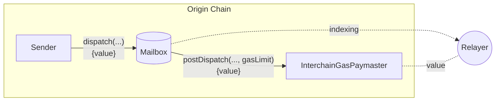
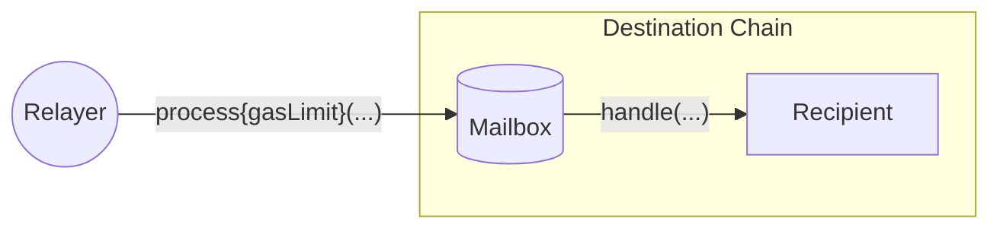

import Tabs from '@theme/Tabs';
import TabItem from '@theme/TabItem';

# 链间燃料费支付

为了[deliver a message](../messaging/receive.mdx)，目标链上必须包含一个事务，该事务使用编码的消息和ISM元数据调用邮箱的 `process`函数。



为了方便起见， [relayer](../../operate/relayer/run-relayer.mdx) 监视已分发的消息，如果消息发送者在原始链上收到足够的付款，则代表消息发送者提交进程事务。我们称之为**链间燃料费支付**。



因为消息可以触发任意代码执行，所以中继器必须用`gasLimit`测量[`handle` call](../messaging/receive.mdx#handle) ，以便在消息分发时适当收费。

$$
txCost = gasPrice * gasLimit
\\[5pt]
exchangeRate = \frac{originGasTokenPrice}{destinationGasTokenPrice}
\\[5pt]
originFee = exchangeRate * txCost
$$

## Post Dispatch

在发送后钩子期间，如果付款不足以支付中继器的“预期”成本，则 `InterchainGasPaymaster`合同将回滚。中继器将尊重`dispatch` 时间的报价。

### Gas Limit

当没有指定时，用于计量`handle` 调用的 `gasLimit`使用静态默认值`50_000`。

:::tip
我们建议开发人员在单元测试中对他们的[`handle` implementations](../messaging/receive.mdx#handle) 进行基准测试，以确定要使用的合理`gasLimit`。
:::

如果你希望 `handle` 函数消耗超过这个默认值，你应该覆盖[default `gasLimit` in metadata](#metadata)。

### 退款

如果消息发送方支付的金额超过钩子报价，合同将退还差额。如果没有指定，退款地址将默认为消息发送方。这允许发送方跳过显式的`quoteDispatch` 调用。

:::warning
退款可能存在[reentrancy](https://www.certik.com/resources/blog/3K7ZUAKpOr1GW75J2i0VHh-what-is-a-reentracy-attack)。应特别注意确保安全，防止再入漏洞。
:::

只有在付款金额大于报价的情况下才会退款。如果发送所需的燃料费比已支付的燃料费少，则**不会**退款。如果退款不成功，`payForGas`调用将回滚。要指定不同的退款地址，请覆盖[default `refundAddress` in metadata](#metadata)。

### 元数据

这个钩子需要`StandardHookMetadata`的打包编码的元数据。关于如何传递元数据覆盖，请参阅邮箱Mailbox [dispatch overloads](../messaging/send.mdx#overriding-default-hook-metadata) 。

<Tabs groupId="lang">
<TabItem value="sol" label="Solidity">

```solidity
struct StandardHookMetadata {
    uint16 variant;
    uint256 msgValue;
    uint256 gasLimit;
    address refundAddress;
}
```

#### 示例

```solidity
bytes memory metadata = abi.encodePacked(
  StandardHookMetadata({
    variant: 1,               // only variant supported by this hook
    msgValue: 0,              // unused by this hook
    gasLimit: 100000,         // override default gas limit
    refundAddress: msg.sender // override default refund address
  })
);
```

</TabItem>
</Tabs>

## Gas Oracles

链间燃料费支付需求是使用支持的始发链和目的地链之间的整体燃料价格和汇率来计算的。

:::info
汇率和天然气价格由中继器决定。 可能会收取差价，以计入漂没和运营成本。
:::

<Tabs groupId="lang">
<TabItem value="sol" label="Solidity">

```solidity file=<rootDir>/node_modules/@hyperlane-xyz/core/contracts/hooks/igp/InterchainGasPaymaster.sol#L224-L228
```

**参数**

- `destinationDomain`: 消息的目的域

**返回**
- `tokenExchangeRate`: 起源链和目的地链的gas代币之间的汇率
- `gasPrice`: 目的地链的燃料价格

</TabItem>
</Tabs>

`quoteGasPayment` 函数计算中继器预期成本的费用。

<Tabs groupId="lang">
<TabItem value="sol" label="Solidity">

```solidity file=<rootDir>/node_modules/@hyperlane-xyz/core/contracts/hooks/igp/InterchainGasPaymaster.sol#L195-L200
```

**参数**
- `destinationDomain`: 消息的目的域
- `gasLimit`: 测量`handle`调用的燃料制

**返回**
- `fee`: `postDispatch` 成功所需的付款

</TabItem>
</Tabs>

## 重试

如果`handle`调用消耗的燃料费超过报价，中继器将不会提交进程事务。在这种情况下，可以使用`payForGas` 功能支付额外的gas。

<Tabs groupId="lang">
<TabItem value="sol" label="Solidity">

```solidity file=<rootDir>/node_modules/@hyperlane-xyz/core/contracts/interfaces/IInterchainGasPaymaster.sol#L24-L29
```

**参数**
- `messageId`: 从`dispatch`调用返回的消息标识符
- `destinationDomain`: 消息的目的域
- `gasAmount`: 额外的燃料费用
- `refundAddress`: 退还超额款项的地址

</TabItem>
</Tabs>
