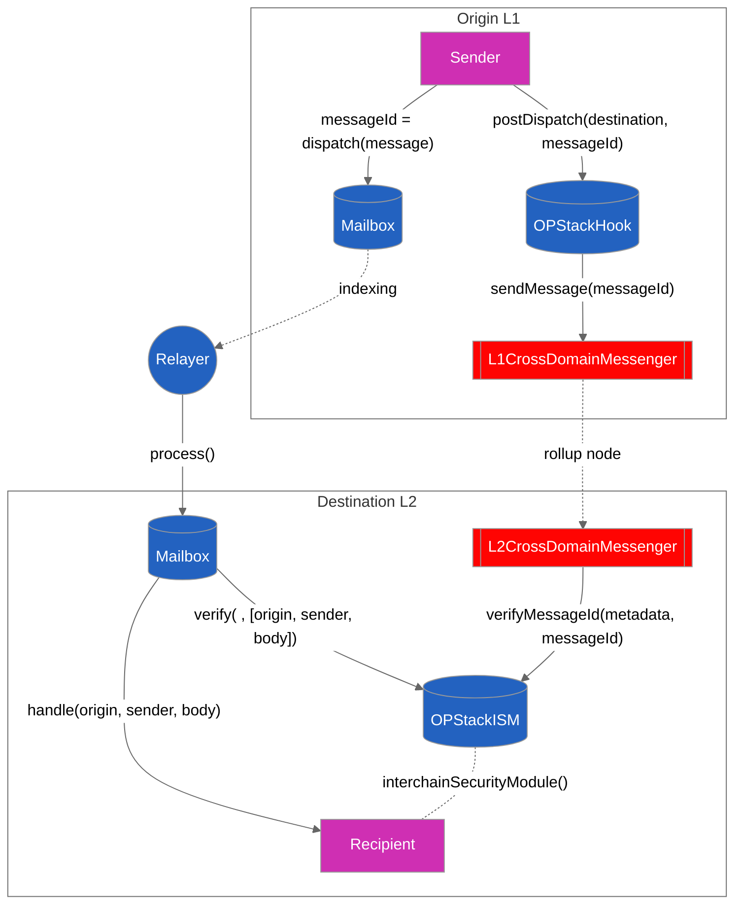

# OPStackHook

Optimism and all the OP Stack chains use the `CrossDomainMessenger` interface for general message passing, `L1CrossDomainMessenger` to send messages from the L1 and the precompile `L2CrossDomainMessenger` to relay the messages onto L2. The canonical rollup bridge is the most trust-minimized bridge because Ethereum is able to verify the rollup state of OP stack deployed on it.

The OPStackHook sends the messageId to the L1CrossDomainMessenger which registers it as an Optimism `TransactionDeposited` event with ETH deposit and message data which gets picked up by the rollup node.
The rollup node calls the precompiled contract `L2CrossDomainMessenger`'s relayMessage function which in turn makes calls configured OptimismISM contract, setting the messageId in the verifiedMessageId's mapping to the original L1 sender (ie. the user). The relayer carries just the message with no metadata, waiting for the Optimism node to pick and make a storage write to Optimism and the message delivery is then verified.

This is currently deployed between Goerli -> Optimism Goerli and Goerli -> Base Goerli. See contract deployments [here](https://github.com/hyperlane-xyz/hyperlane-monorepo/blob/v3/typescript/sdk/src/consts/environments/testnet.json)

