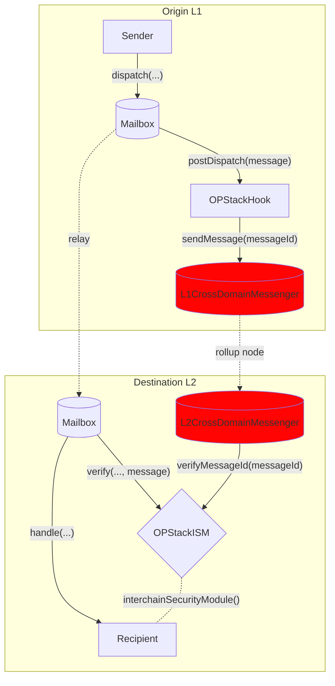

# OP Stack Hook

Optimism and other [OP Stack](https://stack.optimism.io/) rollups have their own interface for message passing between L1 and L2 called the `CrossDomainMessenger`. Messages passed via this interface benefit from the security of the rollup [settlement layer](https://stack.optimism.io/docs/understand/landscape/#execution).

```solidity file=<rootDir>/static/contracts/interfaces/optimism/ICrossDomainMessenger.sol#L15-L19
```

To provide this security as an option to Hyperlane message senders, we created a Hook and ISM combo that can be transparently configured. 

See the [addresses](../contract-addresses.mdx) page for Hook and ISM addresses. 
This is currently deployed between Goerli -> Optimism Goerli and Goerli -> Base Goerli. See contract deployments [here](https://github.com/hyperlane-xyz/hyperlane-monorepo/blob/v3/typescript/sdk/src/consts/environments/testnet.json)

## How It Works

The OPStackHook sends the messageId to the L1CrossDomainMessenger which registers it as an Optimism `TransactionDeposited` event with ETH deposit and message data which gets picked up by the rollup node.
The rollup node calls the precompiled contract `L2CrossDomainMessenger`'s relayMessage function which in turn makes calls configured OptimismISM contract, setting the messageId in the verifiedMessageId's mapping to the original L1 sender (ie. the user). The relayer carries just the message with no metadata, waiting for the Optimism node to pick and make a storage write to Optimism and the message delivery is then verified.


