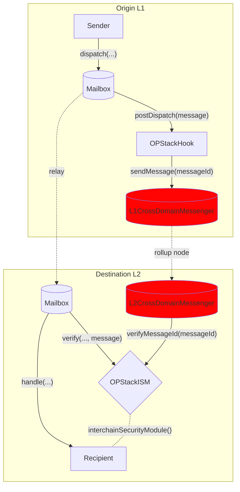

# OP Stack Hook

optimistic和其他[OP Stack](https://stack.optimism.io/)聚合有自己的接口，用于L1和L2之间的消息传递，称为`CrossDomainMessenger`。通过此接口传递的消息受益于rollup[settlement layer](https://stack.optimism.io/docs/understand/landscape/#execution)的安全性。

```solidity file=<rootDir>/node_modules/@hyperlane-xyz/core/contracts/interfaces/optimism/ICrossDomainMessenger.sol#L15-L19
```

为了在Hyperlane中提供这种安全性，我们创建了一个Hook和ISM组合，可以透明地配置以重用本机OP Stack接口。

请参阅[addresses](../contract-addresses.mdx) 页面获取Hook和ISM地址。
目前部署在Goerli -> Optimism Goerli和Goerli -> Base Goerli之间。参见合同部署[here](https://github.com/hyperlane-xyz/hyperlane-monorepo/blob/v3/typescript/sdk/src/consts/environments/testnet.json)

## 它是如何工作的

OPStackHook将messageId发送给L1CrossDomainMessenger，后者将其注册为带有ETH存款和消息数据的Optimism`TransactionDeposited`事件，该事件由rollup节点拾取。

rollup节点调用预编译的合约 `L2CrossDomainMessenger`的relayMessage函数，该函数反过来调用配置的OptimismISM合约，在verifiedMessageId的映射中设置messageId到原始L1发送者(即，用户)。中继器只携带没有元数据的消息，等待Optimism节点选择并对Optimism节点进行存储写入，然后验证消息传递。


