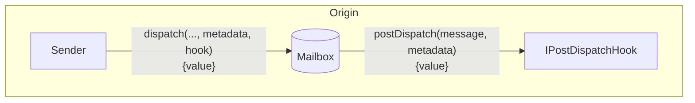
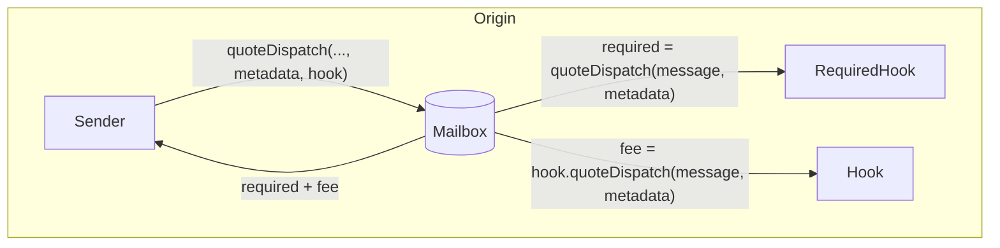
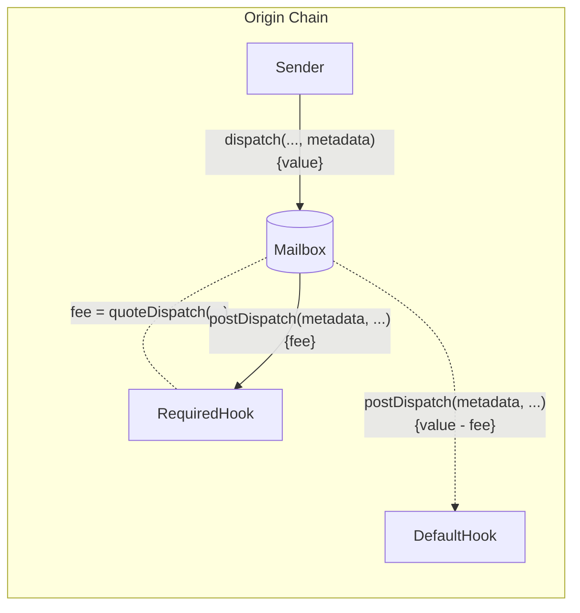
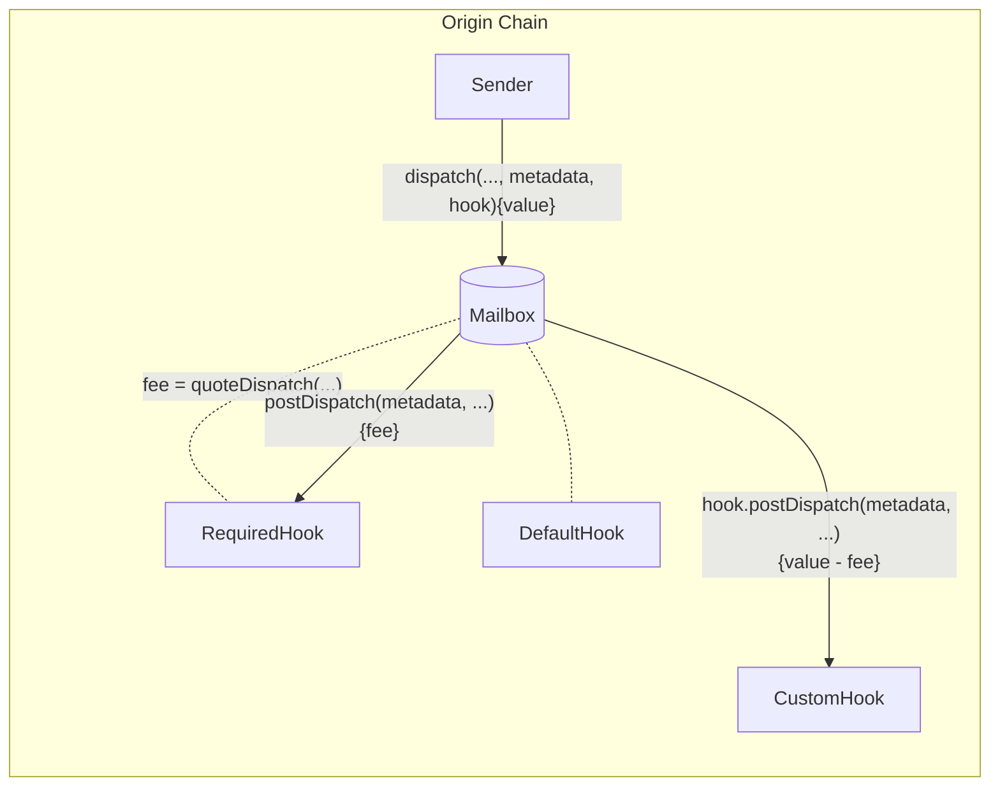

import Tabs from '@theme/Tabs';
import TabItem from '@theme/TabItem';

import { MultiLanguageExample } from "@site/src/components/InteractiveExample";

# Post-Dispatch Hooks

Post-dispatch hooks allow developers to configure additional origin chain behavior with message content dispatched via the Mailbox.



This allows developers to integrate third party/native bridges, make additional chain commitments, or require custom fees all while maintaining a consistent single-call Mailbox interface.

<details>
<summary>`IPostDispatchHook` Interface</summary>

<Tabs groupId="lang">
<TabItem value="sol" label="Solidity">

```solidity file=<rootDir>/node_modules/@hyperlane-xyz/core/contracts/interfaces/hooks/IPostDispatchHook.sol
```

</TabItem>
</Tabs>
</details>

## Post Dispatch

In addition to the `message` dispatched via the Mailbox, the `postDispatch` function receives a `metadata` parameter. The `metadata` parameter is passed from the `dispatch` call through the Mailbox unmodified. This allows developers to pass any context they wish through to the hook.

<Tabs groupId="lang">
<TabItem value="sol" label="Solidity">

```solidity file=<rootDir>/node_modules/@hyperlane-xyz/core/contracts/interfaces/hooks/IPostDispatchHook.sol#L48-L51
```

</TabItem>
</Tabs>

If the `postDispatch` function receives insufficient payment, it may revert. 

### Quote Dispatch (Fees)

Fees are often charged in `postDispatch` to cover costs such as destination chain transaction submission and security provisioning. To receive a quote for a corresponding `postDispatch` call, you can query the `quoteDispatch` function. 


<Tabs groupId="lang">
<TabItem value="sol" label="Solidity">

```solidity file=<rootDir>/node_modules/@hyperlane-xyz/core/contracts/interfaces/hooks/IPostDispatchHook.sol#L59-L62
```

</TabItem>
</Tabs>

The Mailbox has a `quoteDispatch` function that returns the aggregate fee required for a `dispatch` call to be successful. 



{/*
Move to implementing a hook guide?

### Access Control

If `postDispatch` must only be called with a `message` that was *just* dispatched, the `latestDispatchedId` function on the Mailbox can be used to verify the message was *actually* dispatched.

:::info
This is used instead of some `require(mailbox == msg.sender)` to support **composition** where a hook may pass a `message` along to another hook.
:::

<Tabs groupId="lang">
<TabItem value="sol" label="Solidity">

The following utility is provided in the [`MailboxClient` library](../libraries/mailboxclient.mdx) for convenience.
```solidity file=<rootDir>/node_modules/@hyperlane-xyz/core/contracts/client/MailboxClient.sol#L89-L91
```

</TabItem>
</Tabs> */}

## Customize Hooks

Message senders can customize post-dispatch behavior by passing custom metadata or a custom hook address that implements the `IPostDispatchHook` interface.

### Default Hook Metadata

To override the default metadata, there is a `dispatch` overload that takes an optional `metadata` parameter. 

:::info
Hooks currently expect metadata to be formatted with the [`StandardHookMetadata` library](../libraries/hookmetadata.mdx). 
:::

<Tabs groupId="lang">
<TabItem value="sol" label="Solidity">

```solidity file=<rootDir>/node_modules/@hyperlane-xyz/core/contracts/Mailbox.sol#L125-L130

```

</TabItem>
</Tabs>

The custom `metadata` will be passed to the required hook's `quoteDispatch` and `postDispatch` functions, before being passed to the default hook's `postDispatch` function.



#### Examples

<details>
<summary>`StandardHookMetadata` Library</summary>

<Tabs groupId="lang">
<TabItem value="sol" label="Solidity">

```solidity file=<rootDir>/node_modules/@hyperlane-xyz/core/contracts/hooks/libs/StandardHookMetadata.sol
```

</TabItem>
</Tabs>
</details>

<MultiLanguageExample
  solidity={({
    mailbox,
    originChain,
    destinationDomain,
    destinationChain,
    paddedRecipient,
    body,
  }) => `\
// send message from ${originChain} to ${destinationChain} TestRecipient
IMailbox mailbox = IMailbox("${mailbox}");
mailbox.dispatch{value: msg.value}(
  ${destinationDomain},
  "${paddedRecipient}",
  bytes("${body}"),
  StandardHookMetadata.overrideGasLimit(200000)
);
`}
/>

### Custom Hook Contract

To override the default hook configuration, there is a `dispatch` overload that accepts a `hook` and hook `metadata` parameters.



<Tabs groupId="lang">
<TabItem value="sol" label="Solidity">

```solidity file=<rootDir>/node_modules/@hyperlane-xyz/core/contracts/Mailbox.sol#L269-L275

```

#### Examples

<MultiLanguageExample
  solidity={({
    mailbox,
    merkleTreeHook,
    originChain,
    destinationDomain,
    destinationChain,
    paddedRecipient,
    body,
  }) => `\
// send message from ${originChain} to ${destinationChain} TestRecipient
IMailbox mailbox = IMailbox("${mailbox}");
IPostDispatchHook merkleTree = IPostDispatchHook("${merkleTreeHook}");
mailbox.dispatch(
  ${destinationDomain},
  "${paddedRecipient}",
  bytes("${body}"),
  "0x", // empty metadata
  merkleTree
);
`}
/>

</TabItem>
</Tabs>

