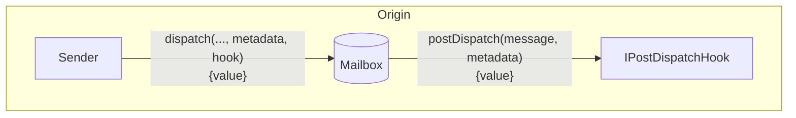
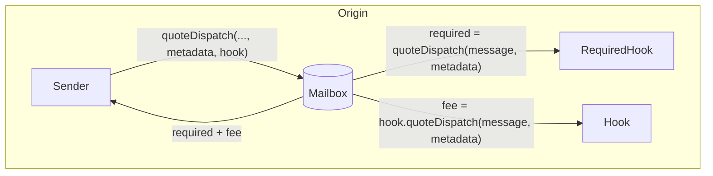
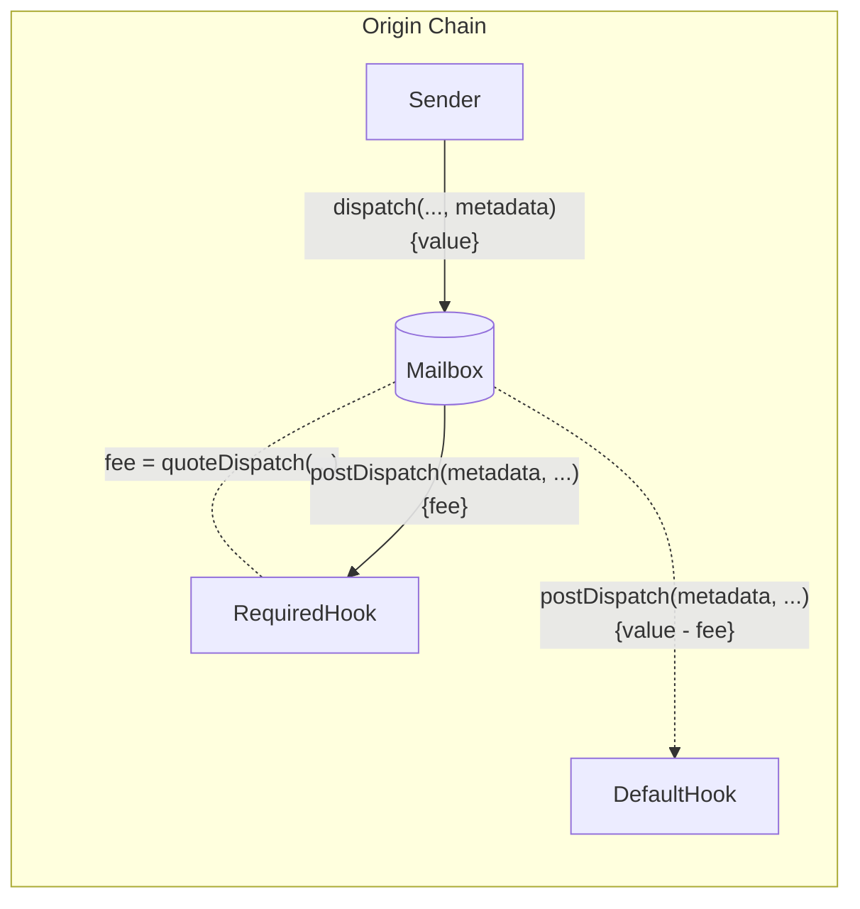

import Tabs from "@theme/Tabs";
import TabItem from "@theme/TabItem";

import { MultiLanguageExample } from "@site/src/components/InteractiveExample";

# Post-Dispatch Hooks

Post-dispatch hooks允许开发人员配置额外的源链行为，通过邮箱分发消息内容。



这允许开发人员在维护一致的单次调用邮箱接口的同时，集成第三方/本地桥，作出额外的链承诺，或要求自定义费用。

<details>
<summary>`IPostDispatchHook` Interface</summary>

<Tabs groupId="lang">
<TabItem value="sol" label="Solidity">

```solidity file=<rootDir>/node_modules/@hyperlane-xyz/core/contracts/interfaces/hooks/IPostDispatchHook.sol

```

</TabItem>
</Tabs>
</details>

## Post Dispatch

除了通过邮箱发送的`message`之外，`postDispatch`函数还接收一个`metadata` 参数。`metadata` 参数从 `dispatch`调用通过未修改的Mailbox传递。这允许开发人员将任何上下文传递给钩子。

<Tabs groupId="lang">
<TabItem value="sol" label="Solidity">

```solidity file=<rootDir>/node_modules/@hyperlane-xyz/core/contracts/interfaces/hooks/IPostDispatchHook.sol#L48-L51

```

</TabItem>
</Tabs>

如果' postDispatch '函数收到的付款不足，它可能会回滚。

### Quote Dispatch (Fees)

通常在 `postDispatch`”中收取费用，以支付目的地链交易提交和安全配置等成本。要接收相应 `postDispatch`调用的报价，可以查询 `quoteDispatch`函数。
<Tabs groupId="lang">
<TabItem value="sol" label="Solidity">

```solidity file=<rootDir>/node_modules/@hyperlane-xyz/core/contracts/interfaces/hooks/IPostDispatchHook.sol#L59-L62

```

</TabItem>
</Tabs>

邮箱有一个`quoteDispatch` 函数，用于返回成功调用`dispatch`所需的总费用。



转到实现钩子指南 [这里](../../guides/create-custom-hook-and-ism.mdx)

### 覆盖默认钩子元数据

为了覆盖默认的元数据，有一个`dispatch`重载，它接受一个可选的`metadata`参数。

:::info
Hooks目前期望使用[`StandardHookMetadata` library](../libraries/hookmetadata.mdx)格式化元数据。
:::

<Tabs groupId="lang">
<TabItem value="sol" label="Solidity">

```solidity file=<rootDir>/node_modules/@hyperlane-xyz/core/contracts/Mailbox.sol#L125-L130

```

</TabItem>
</Tabs>

自定义的`metadata` 将被传递给所需钩子的`quoteDispatch` 和`postDispatch` 函数，然后再传递给默认钩子的`postDispatch`函数。



#### 示例

<details>
<summary>`StandardHookMetadata` Library</summary>

<Tabs groupId="lang">
<TabItem value="sol" label="Solidity">

```solidity file=<rootDir>/node_modules/@hyperlane-xyz/core/contracts/hooks/libs/StandardHookMetadata.sol

```

</TabItem>
</Tabs>
</details>

<MultiLanguageExample
  solidity={({
    mailbox,
    originChain,
    destinationDomain,
    destinationChain,
    paddedRecipient,
    body,
  }) => `\
// send message from ${originChain} to ${destinationChain} TestRecipient
IMailbox mailbox = IMailbox("${mailbox}");
mailbox.dispatch{value: msg.value}(
  ${destinationDomain},
  "${paddedRecipient}",
  bytes("${body}"),
  StandardHookMetadata.overrideGasLimit(200000)
);
`}
/>

### 自定义钩子和元数据

在实现了上面的接口之后，你可以通过在我们的邮箱中重载的`dispatch`调用来覆盖钩子元数据中的默认钩子:

<Tabs groupId="lang">
<TabItem value="sol" label="Solidity">

```solidity file=<rootDir>/node_modules/@hyperlane-xyz/core/contracts/Mailbox.sol#L269-L275

```

### 示例

<MultiLanguageExample
  solidity={({
    mailbox,
    merkleTreeHook,
    originChain,
    destinationDomain,
    destinationChain,
    paddedRecipient,
    body,
  }) => `\
// send message from ${originChain} to ${destinationChain} TestRecipient
IMailbox mailbox = IMailbox("${mailbox}");
IPostDispatchHook merkleTree = IPostDispatchHook("${merkleTreeHook}");
mailbox.dispatch(
  ${destinationDomain},
  "${paddedRecipient}",
  bytes("${body}"),
  "0x", // empty metadata
  merkleTree
);
`}
/>

</TabItem>
</Tabs>
