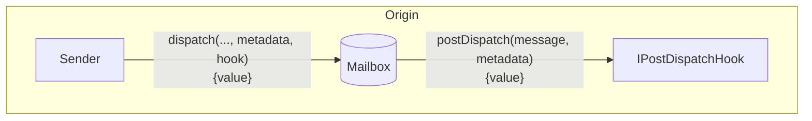
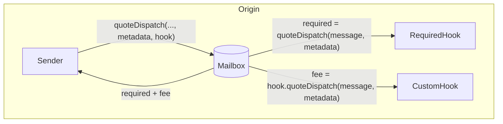

import Tabs from '@theme/Tabs';
import TabItem from '@theme/TabItem';

# Post-Dispatch Hooks

Post-dispatch hooks allow developers to configure additional origin chain behavior with message content dispatched via the Mailbox.



This allows developers to integrate third party/native bridges, make additional chain commitments, or require custom fees all while maintaining a consistent single-call Mailbox interface.

<details>
<summary>`IPostDispatchHook` Interface</summary>

<Tabs groupId="lang">
<TabItem value="sol" label="Solidity">

```solidity file=<rootDir>/static/contracts/interfaces/hooks/IPostDispatchHook.sol
```

</TabItem>
</Tabs>
</details>

## Post Dispatch

In addition to the `message` dispatched via the Mailbox, the `postDispatch` function receives a `metadata` parameter. This is maximally flexible, allowing message senders to pass any context they wish through to the hook.

<Tabs groupId="lang">
<TabItem value="sol" label="Solidity">

```solidity file=<rootDir>/static/contracts/interfaces/hooks/IPostDispatchHook.sol#L49-L51
```

</TabItem>
</Tabs>

**Parameters**

- `metadata`: The metadata required for the hook
- `message`: The message passed from the `dispatch` call

### Access Control

If the `postDispatch` must only be called with a `message` that was *just* dispatched, the `latestDispatchedId` function on the Mailbox can be used to verify the message was *actually* dispatched.

:::info
This is used instead of Mailbox access control to support **composition** where a hook may pass a `message` along to another hook.
:::

<Tabs groupId="lang">
<TabItem value="sol" label="Solidity">

The following utility is provided in the [`MailboxClient` library](../libraries/mailboxclient.mdx) for convenience.
```solidity file=<rootDir>/static/contracts/client/MailboxClient.sol#L91-L93
```

</TabItem>
</Tabs>


## Quote Dispatch

Fees are often configured to cover protocol costs. These include transaction submission on the destination chain, security provisioning, and maintenance. To receive a quote for a corresponding `postDispatch` call, you can query the `quoteDispatch` function.

The Mailbox has a `quoteDispatch` entrypoint that which returns the aggregate fee required for a `dispatch` call to be successful. 



<Tabs groupId="lang">
<TabItem value="sol" label="Solidity">

```solidity file=<rootDir>/static/contracts/interfaces/hooks/IPostDispatchHook.sol#L59-L62
```

</TabItem>
</Tabs>

**Parameters**

- `metadata`: The metadata required for the hook
- `message`: The message passed from the `dispatch` call

**Returns**

- `fee`: The fee required for the `postDispatch` call to be successful
