# Post-Dispatch Hooks

Use native or third-party bridges as "hooks" for your dispatch calls

## Overview

v3 introduces post dispatch hooks for allowing Hyperlane developers flexibility in what kind of security model they prefer. We use merkleTreeHook by default, which ingests each dispatched message into an incremental merkle tree whihc the validators sign and gets verified by the MerkleRootMultisigIsm. Additionally, developers can use the Hooks API to secure their messages either through native bridges like Optimism or use other third-party bridge vendors like Wormhole.
This allows you to inherit the security of a native bridge like Optimism or a third-party vendor like Wormhole. You can opt-in to such do so with hooks without leaving the purview of the Mailbox interface and needing a bridge-specific implementation.

## Interface

You need to implement the `IPostDispatchHook` interface to build you own hook:

```mermaid
flowchart TB
    Relayer((Relayer))

    subgraph Origin
      Sender
      M_O[(Mailbox)]
      Hook[(IPostDispatchHook)]
      E_O[[External provider\n source]]

      Sender -- "messageId = dispatch(message)" --> M_O
      Sender -- "postDispatch(destination, messageId)" --> Hook
      Hook -- "sendMessage(messageId)" --> E_O
    end


    M_O -. "indexing" .-> Relayer
    E_O -. "message passing" .-> E_D


    subgraph Destination
      Recipient
      M_D[(Mailbox)]
      ISM[(ISM - optional)]
      E_D[[External provider\n destination]]

      M_D -- "verify( , [origin, sender, body])" --> ISM
      M_D -- "handle(origin, sender, body)" --> Recipient
      ISM -. "interchainSecurityModule()" .- Recipient

      E_D -- "verifyMessageId(messageId)" --> ISM
    end

    Relayer -- "process()" --> M_D

    style Sender fill: #cf2fb3
    style Recipient fill:#cf2fb3
    style E_O fill: #162a4a
    style E_D fill: #162a4a

```



```solidity
interface IPostDispatchHook {
    /**
     * @notice Returns an enum that represents the type of hook
     */
    function hookType() external view returns (uint8);

    /**
     * @notice Returns whether the hook supports metadata
     * @param metadata metadata
     * @return Whether the hook supports metadata
     */
    function supportsMetadata(bytes calldata metadata)
        external
        view
        returns (bool);

    /**
     * @notice Post action after a message is dispatched via the Mailbox
     * @param metadata The metadata required for the hook
     * @param message The message passed from the Mailbox.dispatch() call
     */
    function postDispatch(bytes calldata metadata, bytes calldata message)
        external
        payable;

    /**
     * @notice Compute the payment required by the postDispatch call
     * @param metadata The metadata required for the hook
     * @param message The message passed from the Mailbox.dispatch() call
     * @return Quoted payment for the postDispatch call
     */
    function quoteDispatch(bytes calldata metadata, bytes calldata message)
        external
        view
        returns (uint256);
}
```

You may or may not need a ISM depending on your hook but if you do, you need to implement the `IInterchainSecuritymModule` like any other ISM. An example where you need the hook and the ISM is [OPStackHook](https://github.com/hyperlane-xyz/hyperlane-monorepo/blob/v3/solidity/contracts/hooks/OPStackHook.sol) and [OPStackIsm](https://github.com/hyperlane-xyz/hyperlane-monorepo/blob/v3/solidity/contracts/isms/hook/OPStackIsm.sol).

### How to quote gas payment for your hook?

Hooks also are a way to abstract away gas payments, which used to be a separate call for Hyperlane V2. Now, you can simply call `quoteDispatch(bytes calldata, bytes calldata)` on the mailbox which calls the same function on the hook you want to call. As a hook developer, you can implement this function to return the expected gas overhead the relayer will incur **only for your specific hook**.

### What's the deal with the metadata in both the `quoteDispatch` and `postDispatch` calls?

At Hyperlane, we understand you may need addition context for your postDispatch call beyond the message like what kind of proof verifier you want to use for a ZKLightClient ISM or where position does the user want the message to process in a batch dispatch on the remote chain. For this, we bestow upon thee metadata.

The metadata is encoded/decoded using our [`StandardHookMetadata`](https://github.com/hyperlane-xyz/hyperlane-monorepo/blob/v3/solidity/contracts/hooks/libs/StandardHookMetadata.sol) library. We've also given you `msgValue`, `gasLimit`, and `refundAmount` already but you can use the `getCustomMetadata` for your hook-specific metadata.

### How do I set my own hook for my messages?

The mailbox contains an overloaded `dispatch()` method where you can pass in your customHook contract address.

```solidity
interface IMailbox {
    function dispatch(
        uint32 destinationDomain,
        bytes32 recipientAddress,
        bytes calldata body,
        bytes calldata customHookMetadata,
        IPostDispatchHook customHook
    ) external payable returns (bytes32 messageId);

    function quoteDispatch(
        uint32 destinationDomain,
        bytes32 recipientAddress,
        bytes calldata messageBody,
        bytes calldata customHookMetadata,
        IPostDispatchHook customHook
    ) external view returns (uint256 fee);
}
```

### What is you want to use multiple hooks?

We allow a simple message to be handled by multiple hooks by using a multihook top-level hook design. All you need to implement the `IPostDispatchHook` interface. You can look at the [`StaticAggregationHook`](https://github.com/hyperlane-xyz/hyperlane-monorepo/blob/v3/solidity/contracts/hooks/aggregation/StaticAggregationHook.sol) which calls all the hooks you want or the [`DomainRoutingHook`](https://github.com/hyperlane-xyz/hyperlane-monorepo/blob/v3/solidity/contracts/hooks/routing/DomainRoutingHook.sol) which can call the hook you specified for a specific destination domain. This allows you flexibility in whatever kind of structure of hooks you want, flat, hierarchical, a mix of both, etc.

### Any gotchas?

Keep in mind the access control patterns. If you have the hook as a privileged actor, make sure only the hook can directly or indirectly call the accompanying ISM on the destination chain. You can use the \_isAuthorized()`in the`OPStackIsm` as an example.

(for `ETHLondon` hackathon: if you have any questions, feel free to reach out to us on Discord.)
