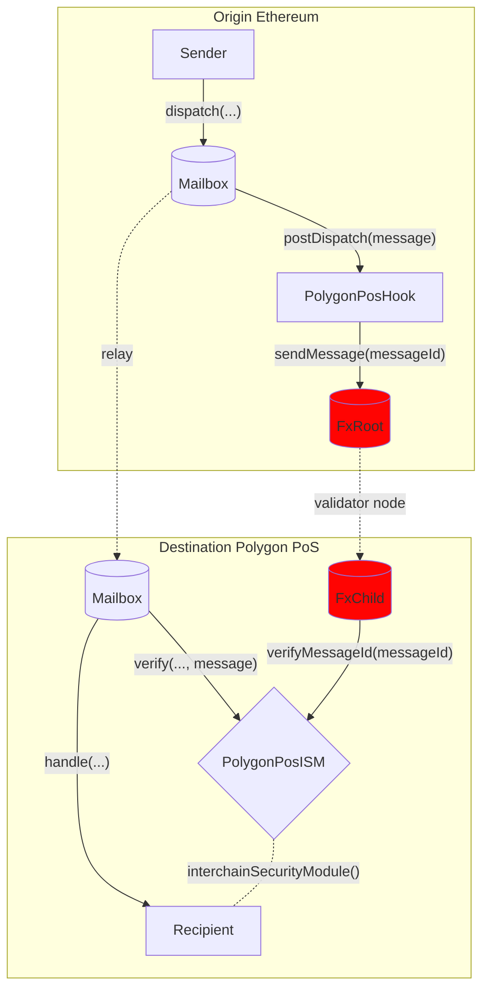

# Polygon PoS Hook

Polygon PoS has their own interface for message passing between Ethereum and Polygon called the [`fx portal`](https://github.com/0xPolygon/fx-portal). Messages passed via this interface benefit from the security of the Polygon [state sync mechanism](https://docs.polygon.technology/pos/architecture/bor/state-sync/).

To provide this security as an option in Hyperlane, we created a Hook and ISM combo that can be transparently configured to reuse the fx-portal interface.

See the [addresses](../contract-addresses.mdx) page for Hook and ISM addresses. 

## How It Works

Polygon FX-Portal provide FxChild (FxChild.sol) and FxRoot (FxRoot.sol) as the main contracts on which the bridge works. It calls and passes data to user-defined methods on another chain without needing a mapping.

The FxChild/FxRoot contract are provided and maintained by the polygon team. You can find the address of this contract in Polygon’s [Fx-Portal repo](https://github.com/0xPolygon/fx-portal). 
The PolygonPosHook sends payloads with FxRoot. Validators will pick up the message and pass it to the other chain. You can find detailed state sync mechanism in [documentation](https://docs.polygon.technology/pos/how-to/bridging/l1-l2-communication/state-transfer/) `StateReceiver` at `0x0000000000000000000000000000000000001001` is allowed to call `onStateReceive` in FxChild contract. FxChild calls `processMessageFromRoot` in abstract `CrossChainEnabledPolygonChild` on which PolygonPosISM implements. `CrossChainEnabledPolygonChild` is maintained by OpenZeppelin. You can find the detail [here](https://docs.openzeppelin.com/contracts/4.x/api/crosschain#) 

