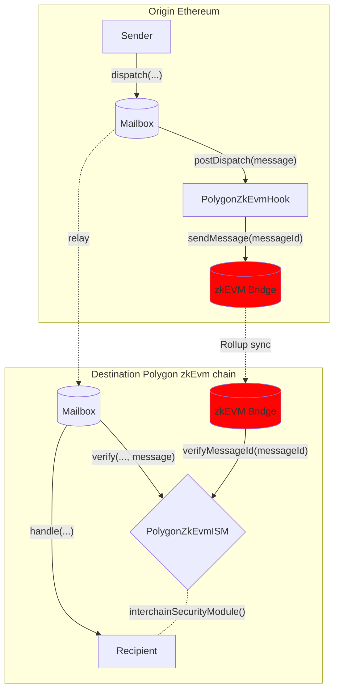

#  PolygonZkevm ISM and hook
Polygon Zkevm have their own bridging interface to transfer assets and messages across the parent and child chain -  [zkEVM Bridge](https://docs.polygon.technology/zkEVM/architecture/protocol/zkevm-bridge/). Message ID is passed via this interface to verify the integrity of the message sent across chain using hyperlane messenger.

To provide this security option in Hyperlane we created the hook and ISM combo that can be transparently configured to use the zkEVM bridge.

See the [addresses](../contract-addresses.mdx) page for Hook and ISM addresses. 

## How It Works

here's the flow for how the system works (this applies to `L1 <-> L2` and `L2<->L1`) : 

the ism verifies if the message has been sent by the hook

