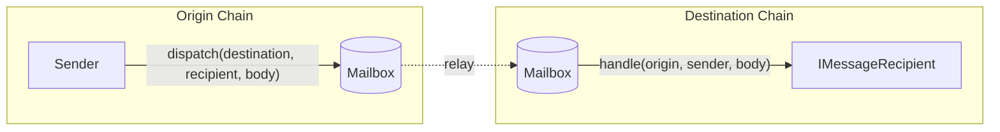

# Messaging API

Hyperlane provides an on-chain API for sending and receiving interchain messages.

#### Interface

To [send](./send.mdx "mention") interchain messages, reference the `Mailbox.dispatch()` API.

To [receive](./receive.mdx "mention") interchain messages, implement the `IMessageRecipient` interface.

#### Interchain gas

Delivering an interchain message requires submitting a transaction on the destination chain. Optionally, you can pay for the gas for this transaction on the origin chain, and let Hyperlane [relayers](../../operate/run-relayer.mdx "mention") deliver your message for you.

Learn more about [paying for interchain gas](./interchaingas.mdx "mention").
