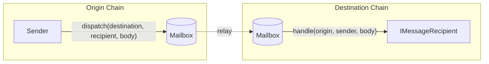

# Mailbox

Hyperlane's generalized message passing (GMP) interface is implemented as a smart contract called the Mailbox. This contract allows other smart contracts to send and receive information (messages) between chains.

To [**send**](./send.mdx) interchain messages, call the `dispatch` function.

To [**receive**](./receive.mdx) interchain messages, implement the `handle` function.

