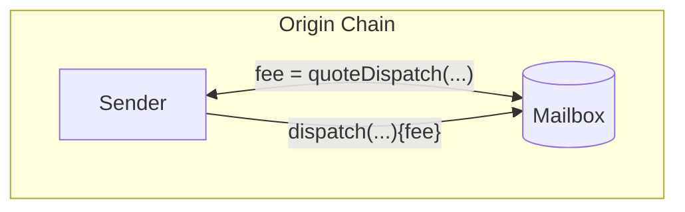
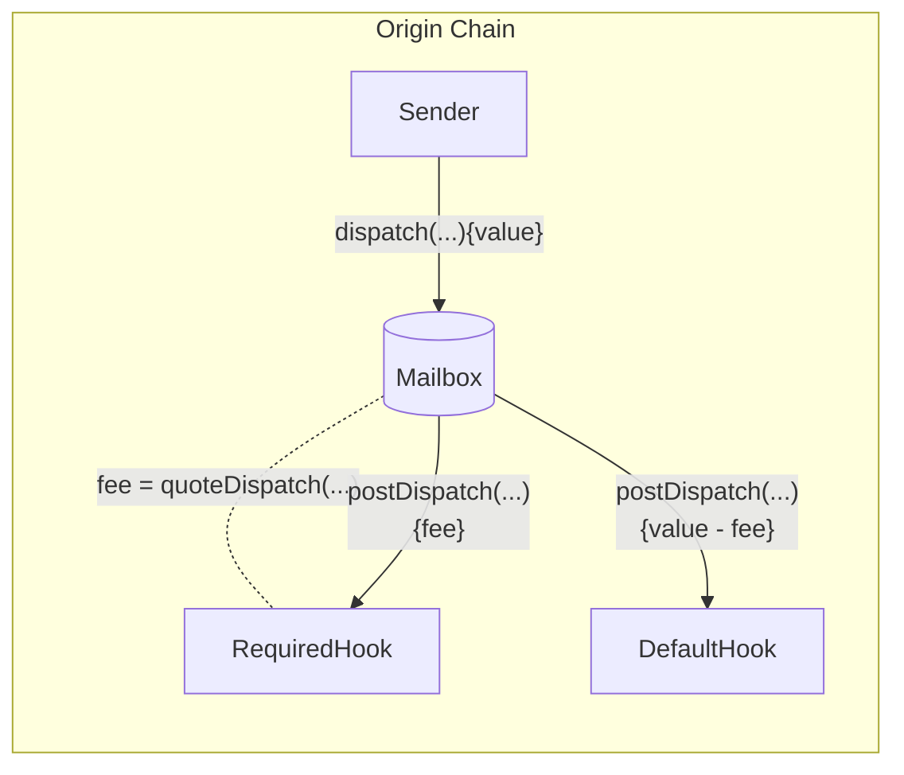

import Tabs from "@theme/Tabs";
import TabItem from "@theme/TabItem";

import { MultiLanguageExample } from "@site/src/components/InteractiveExample";

import SimpleMessagingDiagram from '@site/src/diagrams/messaging-simple.md';

# 发送消息

合约可以通过调用Mailbox上的`dispatch`函数来发送链间消息。

<SimpleMessagingDiagram/>

<details>
<summary>`IMailbox` Interface</summary>

<Tabs groupId="lang">
<TabItem value="sol" label="Solidity">

```solidity file=<rootDir>/node_modules/@hyperlane-xyz/core/contracts/interfaces/IMailbox.sol
```

</TabItem>
</Tabs>
</details>

## Dispatch

调用此函数将消息分发到目标域和收件人。

:::warning
Hyperlane只能向实现`handle`函数的智能合约传递消息。有关更多信息，请参阅 [receive a message](./receive.mdx) 文档。
:::

根据[post-`dispatch` hook configuration](##post-dispatch-hook-config)，可能需要支付一些费用。请参阅[`quoteDispatch`](#quote-dispatch) 小节了解更多信息。

<Tabs groupId="lang">
<TabItem value="sol" label="Solidity">

```solidity file=<rootDir>/node_modules/@hyperlane-xyz/core/contracts/interfaces/IMailbox.sol#L59-L63

```

:::info
为了与地址不同的虚拟机兼容，收件人地址被保留为`bytes32`。为了方便起见，在[`TypeCasts` library](../libraries/typecasts.mdx) 中提供了以下实用程序。

```solidity file=<rootDir>/node_modules/@hyperlane-xyz/core/contracts/libs/TypeCasts.sol#L5-L8

```

:::

</TabItem>
<TabItem value="cw" label="CosmWasm">

🚧 即将到来! 🚧

</TabItem>
<TabItem value="sl" label="Sealevel">

🚧 即将到来! 🚧

</TabItem>
</Tabs>

### 示例

<MultiLanguageExample
  solidity={({
    mailbox,
    originChain,
    destinationDomain,
    destinationChain,
    paddedRecipient,
    body,
  }) => `\
// send message from ${originChain} to ${destinationChain} TestRecipient
IMailbox mailbox = IMailbox("${mailbox}");
bytes32 messageId = mailbox.dispatch{value: msg.value}(
  ${destinationDomain},
  "${paddedRecipient}",
  bytes(\"${body}\")
);`}
/>

## Quote Dispatch

费用通常配置为支付IGP付款和协议费用。这包括目标链上的事务提交、安全配置和维护。要接收对应的`dispatch`调用的报价，你可以查询`quoteDispatch`函数。



<Tabs groupId="lang">
<TabItem value="sol" label="Solidity">

```solidity file=<rootDir>/node_modules/@hyperlane-xyz/core/contracts/Mailbox.sol#L149-L153
```

引用的`fee`必须作为值传递给`dispatch`调用，以确保它不会回滚。

</TabItem>
<TabItem value="cw" label="CosmWasm">

🚧 即将到来! 🚧

</TabItem>
<TabItem value="sl" label="Sealevel">

🚧 即将到来! 🚧

</TabItem>
</Tabs>

### 示例

<MultiLanguageExample
  solidity={({
    mailbox,
    originChain,
    destinationDomain,
    destinationChain,
    paddedRecipient,
    body,
  }) => `\
// quote sending message from ${originChain} to ${destinationChain} TestRecipient
IMailbox mailbox = IMailbox("${mailbox}");
uint32 destination = ${destinationDomain};
bytes32 recipient = "${paddedRecipient}";
bytes memory body = bytes("${body}");
uint256 fee = mailbox.quoteDispatch(destination, recipient, body);
mailbox.dispatch{value: fee}(destination, recipient, body);
`}
/>

:::danger
对`dispatch`的付款不足将回滚。如果你将钩子组合在一起，超额支付可能不会被退还给消息发送者。
:::

## Post-Dispatch Hook 配置

在邮箱上配置了两个钩子：

- `required`: 所有`dispatch`都会调用，调用值为所需费用
- `default`: 在`required`钩子之后用剩余值调用(除非被覆盖)



### Required Hook

要查询所需的钩子配置，可以调用`requiredHook`函数。

<Tabs groupId="lang">
<TabItem value="sol" label="Solidity">

```solidity file=<rootDir>/node_modules/@hyperlane-xyz/core/contracts/interfaces/IMailbox.sol#L55

```

</TabItem>
</Tabs>

### Default Hook

要查询默认的钩子配置，可以调用 `defaultHook` 函数。

<Tabs groupId="lang">
<TabItem value="sol" label="Solidity">

```solidity file=<rootDir>/node_modules/@hyperlane-xyz/core/contracts/interfaces/IMailbox.sol#L53

```

</TabItem>
</Tabs>

要在`dispatch` 调用中使用自定义钩子覆盖默认钩子，请参见[Hooks Reference](../hooks/overview.mdx)。
