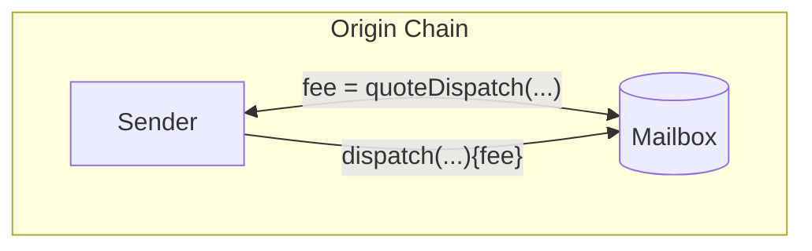
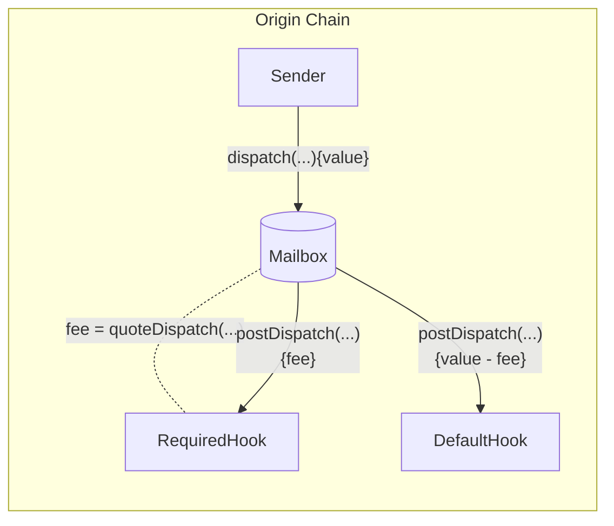

import Tabs from "@theme/Tabs";
import TabItem from "@theme/TabItem";

import { MultiLanguageExample } from "@site/src/components/InteractiveExample";

import SimpleMessagingDiagram from "@site/src/diagrams/messaging-simple.md";

# Send a message

To send interchain messages, developers call `Mailbox.dispatch()`.

This function takes as parameters the message contents, the destination chain ID, and the recipient address. Each message gets inserted as a leaf into an [incremental merkle tree](https://medium.com/@josephdelong/ethereum-2-0-deposit-merkle-tree-13ec8404ca4f) stored by the `Mailbox`. Hyperlane's proof of stake protocol uses this merkle tree to verify fraud proofs.

<SimpleMessagingDiagram />

## Dispatch

Calling this function dispatches a message to the destination domain and recipient.

:::warning
Hyperlane can only deliver messages to smart contracts that implement the `handle` function. See the [receive a message](./receive.mdx) documentation for more information.
:::

Depending on the [post-`dispatch` hook configuration](##post-dispatch-hook-config), some payment may be required. See the [`quoteDispatch`](#quote-dispatch) section for more information.

<Tabs groupId="lang">
<TabItem value="sol" label="Solidity">

```solidity file=<rootDir>/node_modules/@hyperlane-xyz/core/contracts/interfaces/IMailbox.sol#L59-L63

```

:::info
Recipient addresses are left-padded to `bytes32` for compatibility with virtual machines that are addressed differently. The following utility is provided in the [`TypeCasts` library](../libraries/typecasts.mdx) for convenience.

```solidity file=<rootDir>/node_modules/@hyperlane-xyz/core/contracts/libs/TypeCasts.sol#L5-L8

```

:::

</TabItem>

</Tabs>

### Examples

<MultiLanguageExample
  solidity={({
    mailbox,
    originChain,
    destinationDomain,
    destinationChain,
    paddedRecipient,
    body,
  }) => `\
// send message from ${originChain} to ${destinationChain} TestRecipient
IMailbox mailbox = IMailbox("${mailbox}");
bytes32 messageId = mailbox.dispatch{value: msg.value}(
  ${destinationDomain},
  "${paddedRecipient}",
  bytes(\"${body}\")
);`}
/>

## Quote Dispatch

Fees are often configured to cover IGP payments as well as protocol costs. These include transaction submission on the destination chain, security provisioning, and maintenance. To receive a quote for a corresponding `dispatch` call, you can query the `quoteDispatch` function.



<Tabs groupId="lang">
<TabItem value="sol" label="Solidity">

```solidity file=<rootDir>/node_modules/@hyperlane-xyz/core/contracts/interfaces/IMailbox.sol#L65-L69

```

The quoted `fee` must be passed as value to the `dispatch` call to ensure it does not revert.

</TabItem>

</Tabs>

### Examples

<MultiLanguageExample
  solidity={({
    mailbox,
    originChain,
    destinationDomain,
    destinationChain,
    paddedRecipient,
    body,
  }) => `\
// quote sending message from ${originChain} to ${destinationChain} TestRecipient
IMailbox mailbox = IMailbox("${mailbox}");
uint32 destination = ${destinationDomain};
bytes32 recipient = "${paddedRecipient}";
bytes memory body = bytes("${body}");
uint256 fee = mailbox.quoteDispatch(destination, recipient, body);
mailbox.dispatch{value: fee}(destination, recipient, body);
`}
/>

:::danger
Underpayment to `dispatch` will revert. If you are composing hooks together, overpayment **may not be refunded** to the message sender.
:::

## Post-Dispatch Hook Config

There are two hooks configured on a Mailbox

- `required`: invoked for all `dispatch` calls with value that covers the required fee
- `default`: invoked (unless overridden) with remaining value after `required` hook



### Required Hook

To query the required hook configuration, you can call the `requiredHook` function.

<Tabs groupId="lang">
<TabItem value="sol" label="Solidity">

```solidity file=<rootDir>/node_modules/@hyperlane-xyz/core/contracts/interfaces/IMailbox.sol#L55

```

</TabItem>
</Tabs>

### Default Hook

To query the default hook configuration, you can call the `defaultHook` function.

<Tabs groupId="lang">
<TabItem value="sol" label="Solidity">

```solidity file=<rootDir>/node_modules/@hyperlane-xyz/core/contracts/interfaces/IMailbox.sol#L53

```

</TabItem>
</Tabs>

To override the default hook with a custom hook in the `dispatch` call, see the [Hooks Reference](../hooks/overview.mdx).
