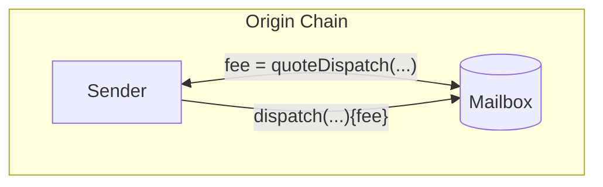
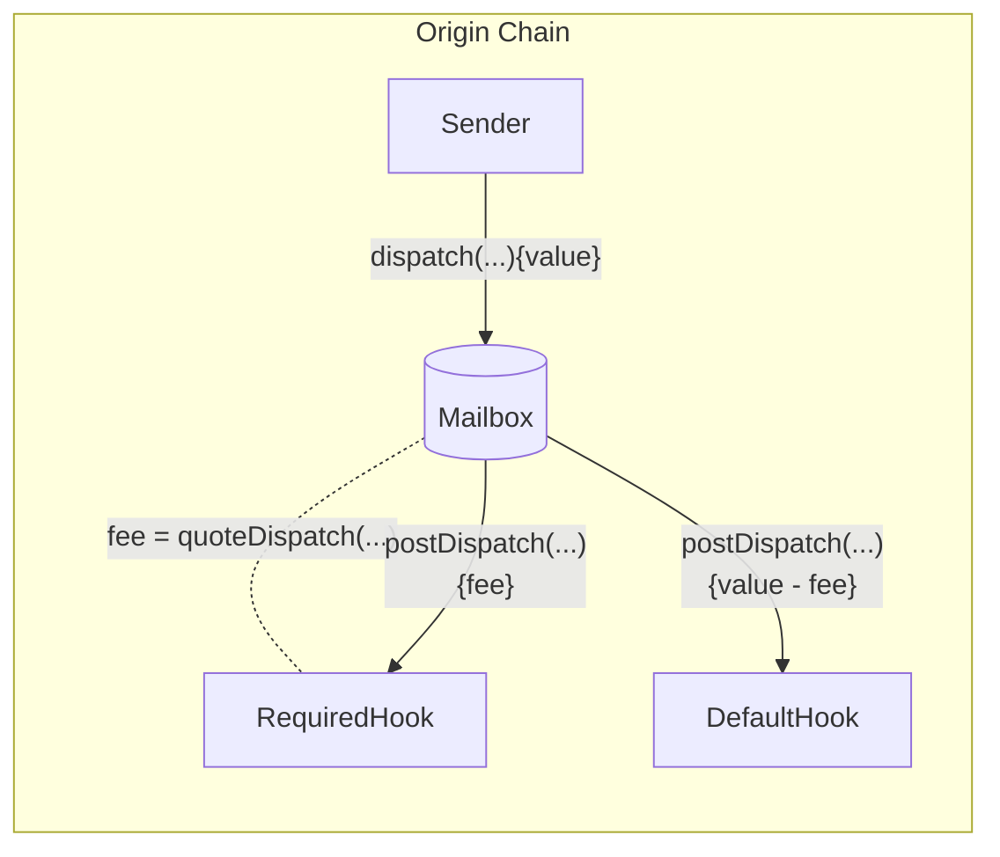
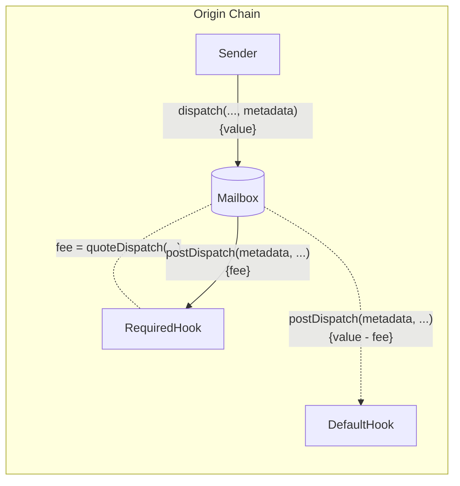
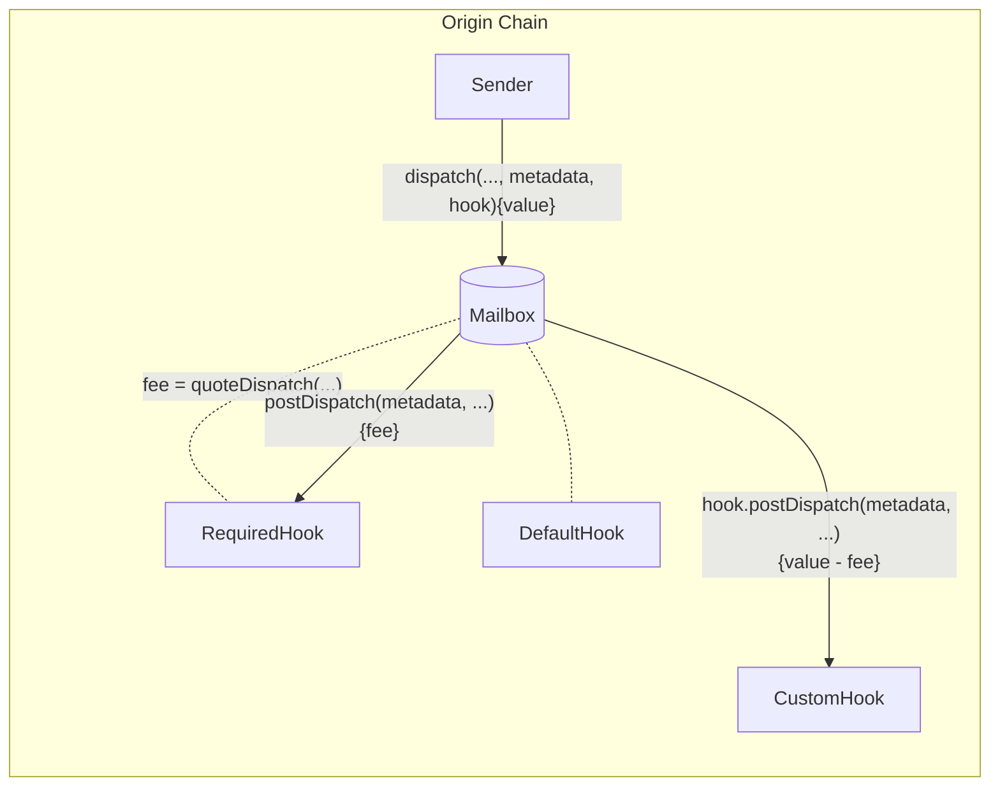

import Tabs from '@theme/Tabs';
import TabItem from '@theme/TabItem';

import SimpleMessagingDiagram from '@site/src/diagrams/messaging-simple.md';

# Send a message

Contracts can send interchain messages by calling the `dispatch` function on the Mailbox.

<SimpleMessagingDiagram/>

## Dispatch

Calling this function dispatches a message to the destination domain and recipient. 

:::warning
Hyperlane can only deliver messages to smart contracts that implement the `handle` function. See the [receive a message](./receive.mdx) documentation for more information.
:::

Depending on the [post-`dispatch` hook configuration](##post-dispatch-hook-config), some payment may be required. See the [`quoteDispatch`](#Quote-Dispatch) section for more information.

<Tabs groupId="lang">
<TabItem value="sol" label="Solidity">

```solidity file=<rootDir>/static/contracts/interfaces/IMailbox.sol#L61-L65
```

**Parameters**

- `destinationDomain`: Domain of destination chain
- `recipientAddress`: Address of recipient on destination chain as bytes32
- `messageBody`: Raw bytes content of message body

**Returns**

- `messageId`: The unique message identifier

:::tip
Recipient addresses are left-padded to `bytes32` for compatibility with virtual machines that are addressed differently.

The following utility is provided in the [`TypeCasts` library](../libraries/typecasts.mdx) for convenience.
```solidity file=<rootDir>/static/contracts/libs/TypeCasts.sol#L5-L8
```
:::

</TabItem>
<TabItem value="cw" label="CosmWasm">

🚧 Coming soon! 🚧

</TabItem>
<TabItem value="sl" label="Sealevel">

🚧 Coming soon! 🚧

</TabItem>
</Tabs>

## Quote Dispatch

Fees are often configured to cover protocol costs. These include transaction submission on the destination chain, security provisioning, and maintenance. To receive a quote for a corresponding `dispatch` call, you can query the `quoteDispatch` function. 




<Tabs groupId="lang">
<TabItem value="sol" label="Solidity">

```solidity file=<rootDir>/static/contracts/Mailbox.sol#L149-L153
```

**Parameters**

- `destinationDomain`: Domain of destination chain
- `recipientAddress`: Address of recipient on destination chain as bytes32|
- `messageBody`: Raw bytes content of message body

**Returns**

- `fee`: The payment required to dispatch the message

</TabItem>
<TabItem value="cw" label="CosmWasm">

🚧 Coming soon! 🚧

</TabItem>
<TabItem value="sl" label="Sealevel">

🚧 Coming soon! 🚧

</TabItem>
</Tabs>

## Post-Dispatch Hook Config

There are two hooks configured on a Mailbox

- `required`: invoked for all `dispatch` calls with value that covers the required fee
- `default`: invoked (unless overriden) with remaining value after `required` hook



### Required Hook

To query the required hook configuration, you can call the `requiredHook` function.

<Tabs groupId="lang">
<TabItem value="sol" label="Solidity">

```solidity file=<rootDir>/static/contracts/interfaces/IMailbox.sol#L57
```

</TabItem>
</Tabs>

### Default Hook

To query the default hook configuration, you can call the `defaultHook` function.

<Tabs groupId="lang">
<TabItem value="sol" label="Solidity">

```solidity file=<rootDir>/static/contracts/interfaces/IMailbox.sol#L55
```

</TabItem>
</Tabs>

## Default Hook Overrides

### Overriding default hook metadata

To override the default hook metadata, there is a `dispatch` overload that 1pts a `metadata` parameter to be used in the configured `defaultHook`.



:::warning
Overriding the default hook metadata is an advanced feature. See the [Hooks](../hooks/overview.mdx) documentation for more information.
:::

<Tabs groupId="lang">
<TabItem value="sol" label="Solidity">

```solidity file=<rootDir>/static/contracts/Mailbox.sol#L125-L130
```

</TabItem>
</Tabs>

### Overriding the default hook and metadata

To override the default hook configuration, there is a `dispatch` overload that accepts a `hook` and hook `metadata` parameters.



:::warning
Overriding the default hook is an advanced feature. See the [Hooks](../hooks/overview.mdx) documentation for more information.
:::

<Tabs groupId="lang">
<TabItem value="sol" label="Solidity">

```solidity file=<rootDir>/static/contracts/Mailbox.sol#L270-L276
```

</TabItem>
</Tabs>
