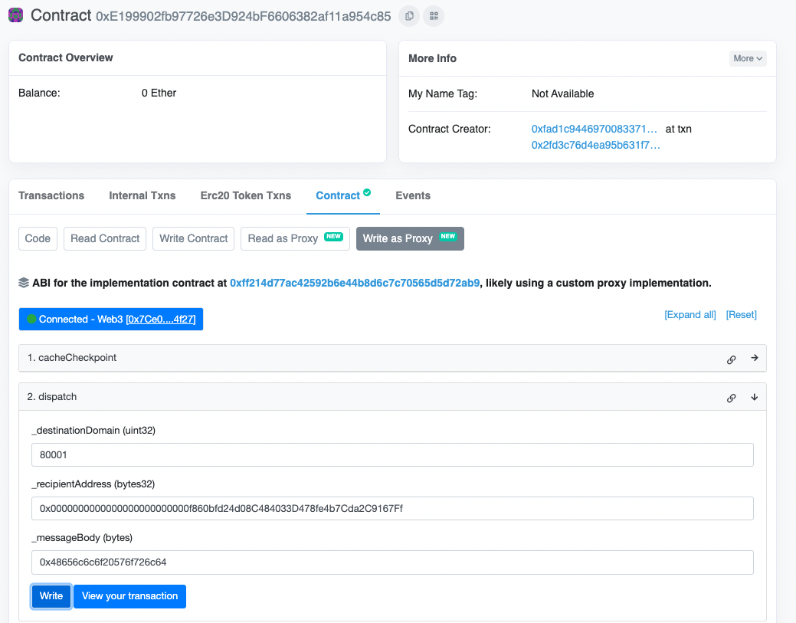

import Tabs from '@theme/Tabs';
import TabItem from '@theme/TabItem';

# Send your first interchain message

This tutorial demonstrates how to:

* [Send](./reference/messaging/send.mdx) a simple interchain message to a pre-deployed [`TestRecipient`](https://github.com/hyperlane-xyz/hyperlane-monorepo/blob/main/solidity/contracts/test/TestRecipient.sol) contract.
* Make interchain gas payments to have the relayer deliver the message.

## Inputs

* `$MAILBOX_ADDRESS`: The [messaging](./protocol/mailbox.mdx) contract address on the origin chain, see [addresses](./reference/contract-addresses.mdx)
* `$DESTINATION_DOMAIN`: The [domain ID](./reference/domains) of the destination chain
* `$RECIPIENT`: The address of the `TestRecipient` contract on the destination chain, left padded to a `bytes32`. In our case: `0x00000000000000000000000036FdA966CfffF8a9Cdc814f546db0e6378bFef35`

## Send a message

Sending a message is a simple matter of calling `Mailbox.dispatch()`. This function can be called easily using Etherscan + [Metamask](https://metamask.io/) or [Cast](https://book.getfoundry.sh/cast/).


<Tabs>
  <TabItem value="cast" label="Cast">
    You can call `Mailbox.dispatch()` directly using `cast`. Make sure that you have a valid RPC URL for the origin chain and a private key with which you can pay for gas.

```shell
cast send $MAILBOX_ADDRESS "dispatch(uint32,bytes32,bytes)" $DESTINATION_DOMAIN $RECIPIENT $(cast --from-utf8 "your message") --rpc-url $RPC_URL
--private-key $PRIVATE_KEY
```

  </TabItem>
  <TabItem value="metamask" label="Etherscan + Metamask" default>
    
1. Navigate to the `Mailbox` contract page on [Etherscan](https://etherscan.io/address/0x35231d4c2D8B8ADcB5617A638A0c4548684c7C70) (see mailbox [contract addresses](./reference/contract-addresses.mdx) for other chains).
2. Under the `Contract` tab, find the `Write as Proxy` button.
3. Click on the `Connect to Web3` button to connect your Wallet (i.e. Metamask). Make sure that you are on the correct network.
4. Expand the `dispatch` box.
5. For destination domain, enter `$DESTINATION_DOMAIN`. You could use `137` to send to mainnet Polygon, or see other [domains](./reference/domains). 
6. For the recipient address, enter `$RECIPIENT`. Remember to make sure to zero-pad this to a `bytes32` if you are using your own address. Alternatively, you can use `0x00000000000000000000000036FdA966CfffF8a9Cdc814f546db0e6378bFef35` (our test recipient address).
7. For the message body, enter whatever you like! A [string-to-hex converter website](https://dencode.com/en/string/hex) can help you write your message if you want to send a human-readable message. In the example below, we sent the "Hello World" string as `0x48656c6c6f20576f726c64`
8. Submit the transaction via your wallet/Metamask


  </TabItem>
</Tabs>

:::warning

For your transfer to be executed on the destination chain, you **must** manually [pay for interchain gas](./guides/IGP/manually-paying-interchain-gas.mdx), using `100000` for the gas amount

:::