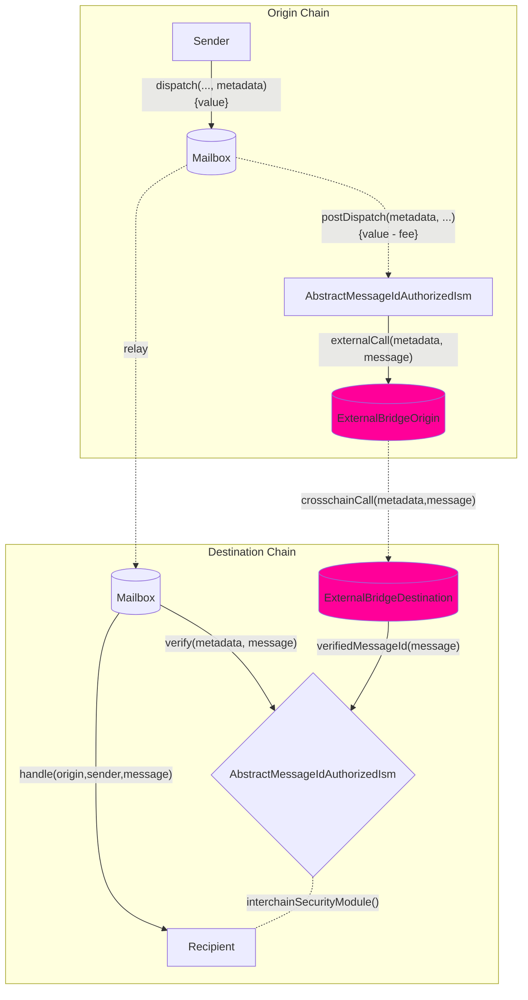

import Tabs from "@theme/Tabs";
import TabItem from "@theme/TabItem";

import { MultiLanguageExample } from "@site/src/components/InteractiveExample";

# 创建自定义 Hook 和 ISM

Hook 和 ISM 具有互补关系：您可以在源链上自定义行为，并在目标链上使用成对的 ISM 合约来验证您的自定义 hook 行为。

您可以根据需求实现和使用自己的 hook 和 ISM 模式。您可以通过在源链上实现 `IPostDispatchHook` 接口和在目标链上实现 `IInterchainSecurityModule` 来使用 Wormhole 或 Chainlink 的 CCIP 等外部桥接提供商。

<details>
<summary>`IPostDispatchHook` 接口</summary>

<Tabs groupId="lang">
<TabItem value="sol" label="Solidity">

```solidity file=<rootDir>/node_modules/@hyperlane-xyz/core/contracts/interfaces/hooks/IPostDispatchHook.sol#L16-L63
interface IPostDispatchHook {
    /**
     * @notice Returns the amount of native tokens that should be provided when calling
     * postDispatch for a given message
     * @dev The hook may charge an additional fee on top of the base Hyperlane fee
     * @param metadata Metadata provided to mailbox dispatch call
     * @param message The message being dispatched
     * @return The amount of native tokens that should be provided when calling postDispatch
     */
    function quoteDispatch(bytes calldata metadata, bytes calldata message)
        external
        view
        returns (uint256);

    /**
     * @notice Called by a Mailbox after dispatching a message
     * @dev msg.value must equal the amount specified by quoteDispatch
     * @param metadata Metadata provided to mailbox dispatch call
     * @param message The message being dispatched
     */
    function postDispatch(bytes calldata metadata, bytes calldata message)
        external
        payable;
}
```

</TabItem>
</Tabs>
</details>

<details>
<summary>`IInterchainSecurityModule` 接口</summary>

<Tabs groupId="lang">
<TabItem value="sol" label="Solidity">

```solidity file=<rootDir>/node_modules/@hyperlane-xyz/core/contracts/interfaces/IInterchainSecurityModule.sol#L4-L35
interface IInterchainSecurityModule {
    /**
     * @notice Returns whether the message is verified
     * @dev Called by a router before message processing
     * @param metadata Metadata provided to mailbox dispatch call
     * @param message The message being dispatched
     * @return True if the message is verified
     */
    function verify(bytes calldata metadata, bytes calldata message)
        external
        payable
        returns (bool);
}
```

</TabItem>
</Tabs>
</details>

:::info
Hook 目前需要使用 [`StandardHookMetadata` 库](../reference/libraries/hookmetadata.mdx)格式化元数据。
:::

您还可以继承我们的 `AbstractMessageIdAuthorizedIsm`，它允许对中间的 `verifyMessageId` 函数调用进行访问控制，如果从授权的 `AbstractMessageIdAuthHook` hook 接收到消息，该函数会在存储中将 messageId 设置为 true。这种模式目前用于 [`OpStackHook`](https://github.com/hyperlane-xyz/hyperlane-monorepo/blob/ef2ece300e71a30e8f4f59e5b26e21eea012d43b/solidity/contracts/hooks/OPStackHook.sol#L33C8-L33C8)  [`OpStackIsm`](https://github.com/hyperlane-xyz/hyperlane-monorepo/blob/ef2ece300e71a30e8f4f59e5b26e21eea012d43b/solidity/contracts/isms/hook/OPStackIsm.sol#L31) 模式。

### 工作流程



### 接口

实现上述接口后，您可以通过使用我们的 mailbox 中的重载 `dispatch` 调用来覆盖默认 hook 和 hook 元数据：

<Tabs groupId="lang">
<TabItem value="sol" label="Solidity">

```solidity
/**
 * @notice Dispatches a message to the destination domain & recipient.
 * @param _destinationDomain Domain of destination chain
 * @param _recipientAddress Address of recipient on destination chain as bytes32
 * @param _messageBody Raw bytes content of message body
 * @param _metadata Metadata used by the post dispatch hook
 * @param _hook Custom hook to use instead of the default
 * @return The message ID inserted into the Mailbox's merkle tree
 */

```

</TabItem>
</Tabs>

### 示例

<Tabs groupId="lang">
<TabItem value="sol" label="Solidity">

<MultiLanguageExample
  solidity={({
    mailbox,
    merkleTreeHook,
    originChain,
    destinationDomain,
    destinationChain,
    paddedRecipient,
    body,
  }) => `\
// 从 ${originChain} 发送消息到 ${destinationChain} TestRecipient
IMailbox mailbox = IMailbox("${mailbox}");
IPostDispatchHook merkleTree = IPostDispatchHook("${merkleTreeHook}");
mailbox.dispatch(
  ${destinationDomain},
  "${paddedRecipient}",
  bytes("${body}"),
  "0x", // empty metadata
  merkleTree
);`}
/>

</TabItem>
</Tabs>

- 在源链上，

  - `mailbox.dispatch()` 通过 `AbstractMessageIdAuthHook.postDispatch()` 调用您的自定义 hook。
  - `_postDispatch` 检查 `latestDispatchedId` 是否是从 hook 分发的 ID，以确保 mailbox 是调用 hook 的合约（因为调用 `postDispatch` 不受访问控制）。
  - `_sendMessageId` 调用您的自定义外部桥接逻辑，比如调用 CCIP 路由器合约。

- 在目标链上，
  - 外部桥接器将调用 `verifyMessageId` 函数（该函数受访问控制）并将 `messageId` 在 `verifiedMessages` 映射中设置为 true。
  - 在接收到中继器的消息时，mailbox 将调用您的 ISM 合约（在您的接收者地址中指定），该合约检查 `verifiedMessages` 映射中的 messageId 是否为 true，并相应地向 mailbox 返回 true 或 false。

:::warning
`AbstractMessageIdAuthorizedIsm` 可以通过 `postDispatch` 调用发送 `msg.value`，我们使用 `verifiedMessages` 的小端序 255 位来存储 `msg.value`，最高位用于实际的 messageId 传递接收。因此，您可以从源链发送最多 2^255 数量的原生代币，目标链上的 ISM 只能接收 2^255 数量的原生代币。
:::

### 访问控制

如果 `postDispatch` 只能使用刚刚分发的 `message` 调用，可以使用 Mailbox 上的 `latestDispatchedId` 函数来验证消息是否实际被分发。

:::info
这是用来代替 `require(mailbox == msg.sender)` 的方式，以支持**组合**，其中一个 hook 可能会将 `message` 传递给另一个 hook。
:::

<Tabs groupId="lang">
<TabItem value="sol" label="Solidity">

为了方便起见，[`MailboxClient` 库](../reference/libraries/mailboxclient.mdx)提供了以下实用工具。

```solidity
* @notice Sets the address of the application's custom interchain security module.
* @param _module The address of the interchain security module contract.
*/
```

</TabItem>
</Tabs>
