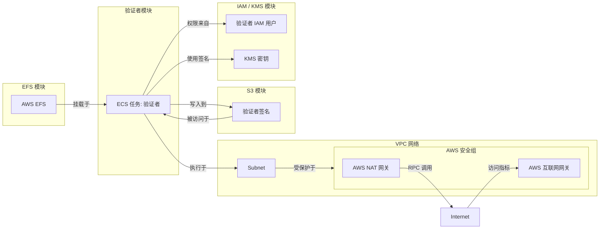
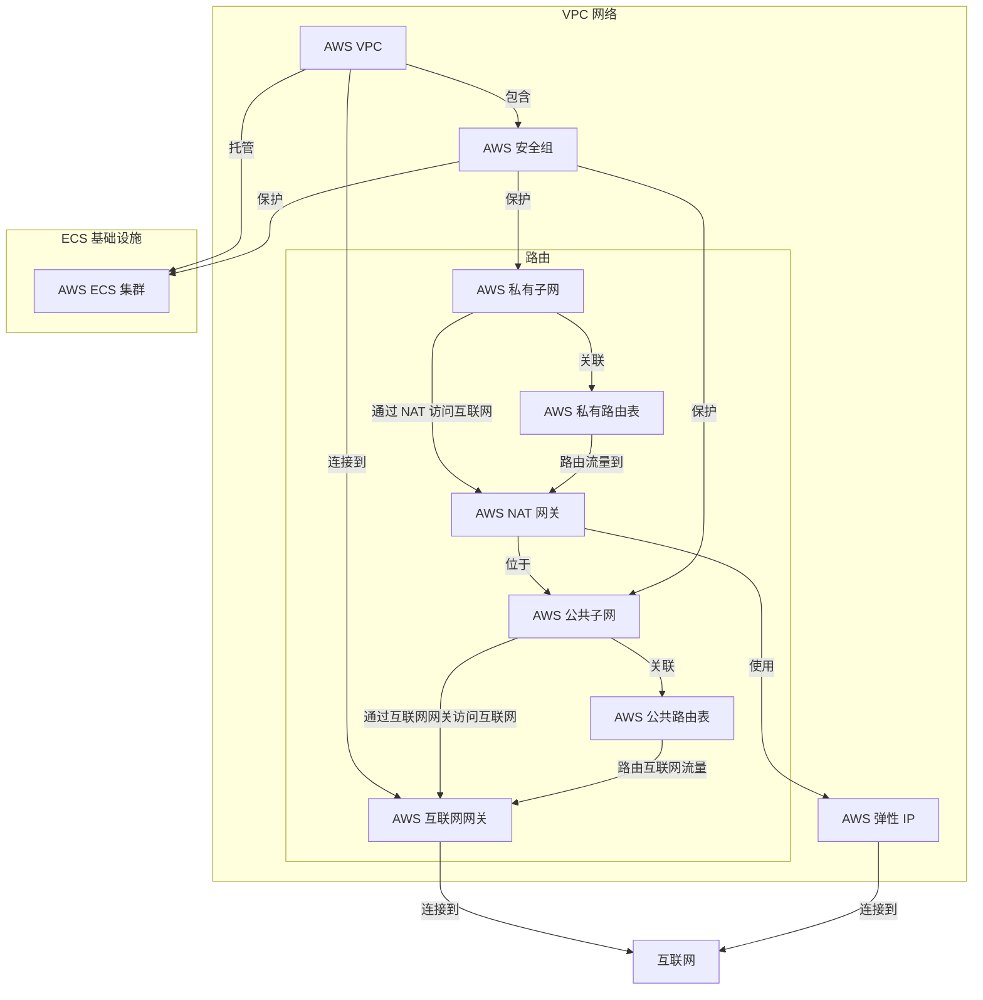

# 使用 Terraform 部署

对于那些更熟悉使用基础设施即代码（Infrastructure-as-Code）工具（如 Terraform）部署到 AWS 的用户，我们在 [**Github 上提供了示例配置**](https://github.com/hyperlane-xyz/hyperlane-monorepo/tree/main/rust/main/terraform)，用于在 AWS 上设置 Hyperlane 验证者所需的基础设施。它自动创建运行验证者代理所需的资源，如 ECS 集群、VPC、子网和安全组。

:::caution

提供的配置仅作为运行核心支持网络验证者的_示例_。你可能需要修改验证者模块以支持更高级的配置。建议在生产环境中使用此设置之前进行彻底测试。

:::

## 概述

提供的 terraform 配置包含几个关键部分：

- IAM/KMS 模块：自动为你完成[代理密钥](set-up-agent-keys.mdx)配置。
- S3 模块：自动为你完成 [AWS 签名存储桶](validators/validator-signatures-aws.mdx)配置。
- EFS 模块：设置可以挂载到验证者的持久卷。
- 验证者模块：使用上述模块来运行验证者实例。
- `global.tf`：验证者可以运行的集群的顶层网络配置。
- `main.tf`：配置验证者以进行部署。

下图展示了它们是如何组合在一起的。



## 使用方法

作为先决条件，你需要安装 Terraform 并配置好带有你的凭证的 AWS CLI。

要初始化 terraform 状态：

```bash
terraform init
```

要生成基础设施变更计划：

```bash
terraform plan
```

要预览并应用基础设施变更：

```bash
terraform apply
```

要列出 KMS、IAM 或 S3 等信息的输出，你需要解析 JSON 输出：

```bash
terraform output -json
```

## 模块

存在几个模块，你可以选择由 terraform 管理验证者设置的哪些部分。

### IAM / KMS

`iam_kms` 模块创建一个 IAM 用户和一个用于安全签名操作的 KMS 密钥。它还设置 IAM 策略和附件，以授予使用 KMS 密钥和其他 AWS 服务（如 S3、EFS 和 ECS）所需的权限。

### S3

`s3` 模块创建一个用于存储验证者相关数据（如签名）的 S3 存储桶。它还设置存储桶策略来管理访问和权限，包括公共访问限制和版本控制。

### EFS

`efs` 模块定义了一个 EFS 文件系统和访问点，允许验证者应用程序在 EFS 上存储和访问数据。它还设置一个挂载目标，用于将 EFS 文件系统连接到网络。

:::note
此模块仅在使用 `validator` 模块时需要。
:::

### 验证者

`validator` 模块使用上述所有模块来集成 EFS、IAM/KMS 和 S3 配置。

除了：
- 创建新的 IAM 用户和相关角色以运行验证者。
- 创建验证者可以写入签名的 S3 存储桶。
- 创建 EFS 卷以在服务中持久化数据。

此模块还：
- 定义用于运行验证者应用程序的 ECS 任务定义，包括容器定义、卷配置和日志记录。
- 创建 ECS 服务以管理验证者任务的部署和扩展。

## 主要配置

根级配置设置 VPC、子网、互联网网关、NAT 网关、路由表和网络基础设施的安全组。它还提供了 `validator` 模块的示例用法。

```terraform
module "your_validator_name" {
  source = "./modules/validator"

  validator_name    = "your-validator-name"
  origin_chain_name = "originChainName"

  aws_region               = var.aws_region
  validator_cluster_id     = aws_ecs_cluster.validator_cluster.id
  validator_subnet_id      = aws_subnet.validator_subnet.id
  validator_sg_id          = aws_security_group.validator_sg.id
  validator_nat_gateway_id = aws_nat_gateway.validator_nat_gateway.id

  # 禁用验证者任务允许你设置所有必需的基础设施，而无需立即运行实际的验证者。
  # 这在首次设置验证者时很有用，这样你可以在它执行公告交易之前找到验证者的地址并为其提供资金。
  # validator_task_disabled = true
}
```

### 输出

根级别的 `outputs.tf` 转发 `main.tf` 中配置的所有验证者的输出。**当你添加、修改或删除验证者时，你需要更新这个文件。**

### 示例架构

下图显示了验证者 ECS 集群如何适配顶层网络基础设施。



## 已知问题

### PI 配置

为 PI 链设置自定义配置值（例如你自己部署 Hyperlane 的链）并不简单。
目前你可能必须传递一长串环境变量或命令行参数。

### 单个代理日志

目前所有代理都记录到同一个日志组 - `DefaultLogGroup`。要按代理分离它们，你可能需要调整日志组名称并使用新的组名更新代理的日志策略。

### 中继器模块

Docker 镜像支持运行两种类型的代理。因此，如果你选择这样做，你可以使用验证器模块作为新的中继器模块的起点。