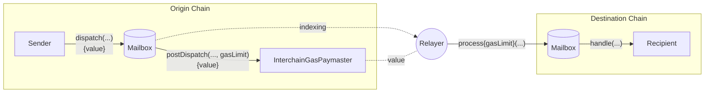

# 概述

Hyperlane 协议将跨链消息传递的传输层与安全层解耦。要运行一个部署，它依赖于观察链上活动并执行协议的传输或安全方面的链下代理。

1. Hyperlane [验证者](#validator)是负责安全的轻量级链下代理 - 它们观察源链上的 [Mailbox](docs/protocol/mailbox.mdx) 并在需要时签署一个 merkle 根来证明邮箱的当前状态。
2. [中继者](#relayer)满足协议的消息传输要求。它们为 [`IInterchainSecurityModule` 接口](/docs/protocol/ISM/modular-security.mdx)聚合链下安全元数据并将消息传递给接收者。

## 验证者 {#validators}

[验证者](docs/protocol/agents/validators.mdx)作为[多重签名 ISM](docs/protocol/ISM/multisig-ISM.mdx)或 [Hyperlane AVS](docs/protocol/economic-security/hyperlane-avs.mdx)的一部分，通过验证 [Mailbox](docs/protocol/mailbox.mdx) 消息的有效性并将其签名提供给中继者来满足协议的安全要求。

这个签名被存储并公开可用（例如在 S3 存储桶中），然后由链下中继者和链上跨链安全模块使用。验证者之间_不_需要网络连接，也不需要达成共识；他们也不需要定期提交链上交易。

如果社区运营者希望帮助保护源链的安全，这就是他们需要运行的代理，这也是帮助去中心化 Hyperlane 消息传递最重要的职责。**请注意，仅仅运行一个验证者并不意味着它正在积极地为消息安全做出贡献：**目标链上的多重签名 ISM 必须已经注册了验证者的检查点签名密钥，并且消息接收者必须使用该 ISM。

这些代理使用 Rust 实现，并以 Docker 镜像和二进制文件的形式分发。

👉 在[这里](docs/protocol/agents/validators.mdx)了解更多关于验证者的信息。

## 中继者 {#relayer}

Hyperlane [中继者](docs/protocol/agents/relayer.mdx)负责将跨链消息传递给接收者。

中继是无需许可的，在一对链之间只需要一个诚实的中继者就足以确保活性。运行中继者：1) 在操作上比验证者复杂得多；2) 对网络安全不是必需的；3) 仅推荐用于无需许可的 Hyperlane 部署。

Hyperlane 中继者被配置为在一个或多个源链和目标链之间中继消息。
每个 Hyperlane 消息涉及两个交易：

1. 在源链上[`dispatch`](docs/reference/messaging/send.mdx)并发送消息。
2. 在目标链上[`process`](docs/reference/messaging/receive.mdx)并传递消息。

中继者的工作是在目标链上传递消息。为了完成这个责任：

- 中继者跟踪源链上出现的新消息。
- 它检查接收者指定的[跨链安全模块 (ISM)](/docs/protocol/ISM/modular-security.mdx)以收集保护消息所需的元数据。例如，它可能从验证者检查点存储中检索多重签名 ISM 签名。
- 在组装安全元数据后，中继者将消息发送给目标链上的接收者。

如果消息传递失败（例如由于缺乏流动性从 Warp Route 合约转出），中继者会使用指数退避机制重试传递，直到成功。

中继者在 Hyperlane 中没有特殊权限。如果中继者密钥被泄露，只有这些密钥持有的代币面临风险。

👉 在[这里](docs/protocol/agents/relayer.mdx)了解更多关于中继者的信息。
