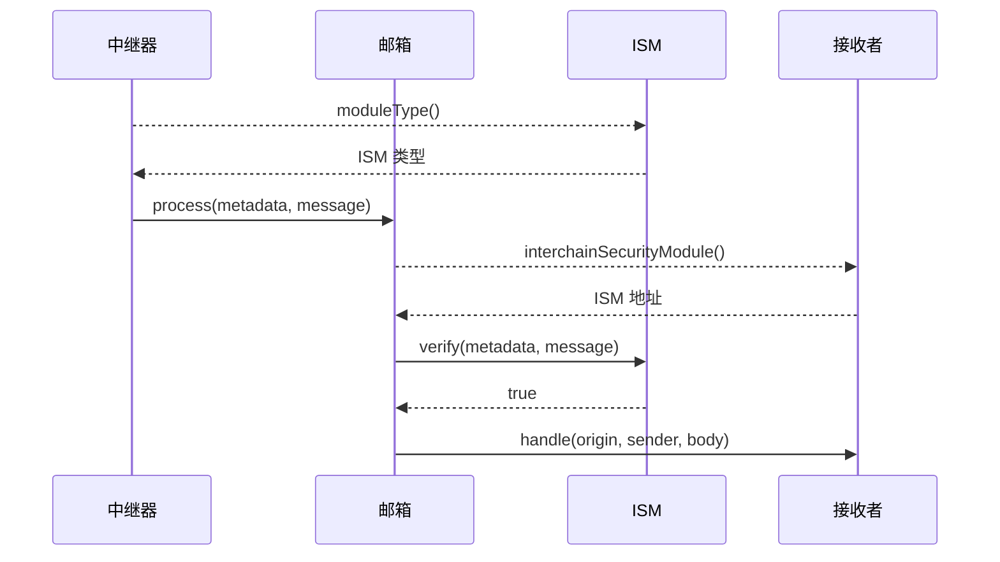

# 时序图

以下是跨链消息在目标链上被验证和传递的简化时序图。

:::info

- 如果接收者没有实现 `ISpecifiesInterchainSecurityModule` 或 `recipient.interchainSecurityModule()` 返回 `address(0)`，将使用 [Mailbox](../mailbox.mdx) 上配置的默认 ISM 来验证消息。
- 为了清晰起见，这部分内容在时序图中被省略。

:::

