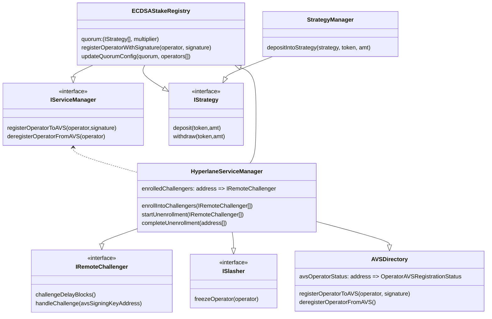
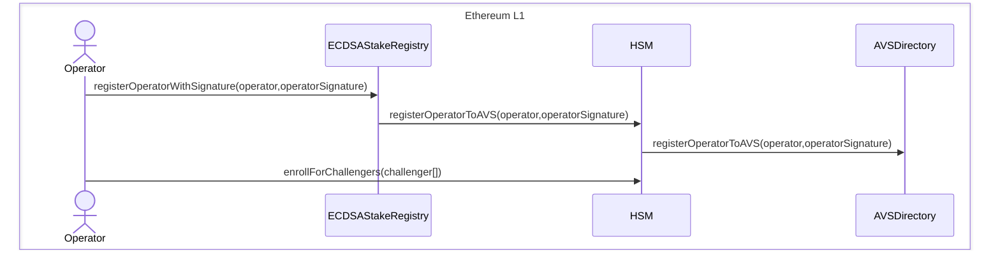
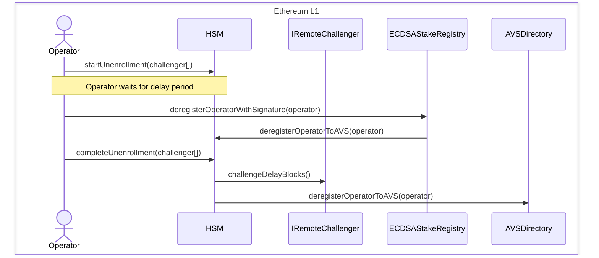
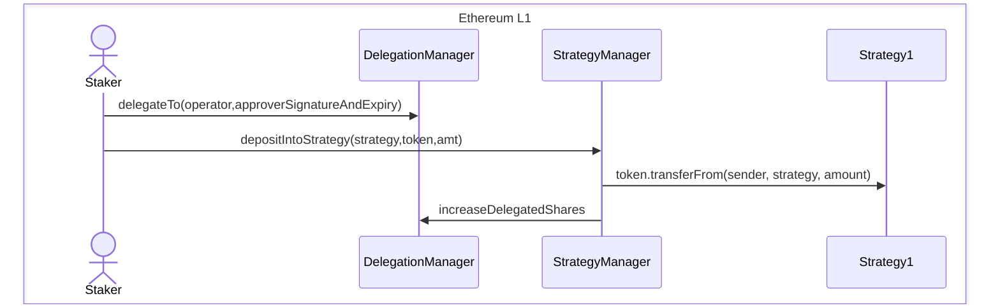
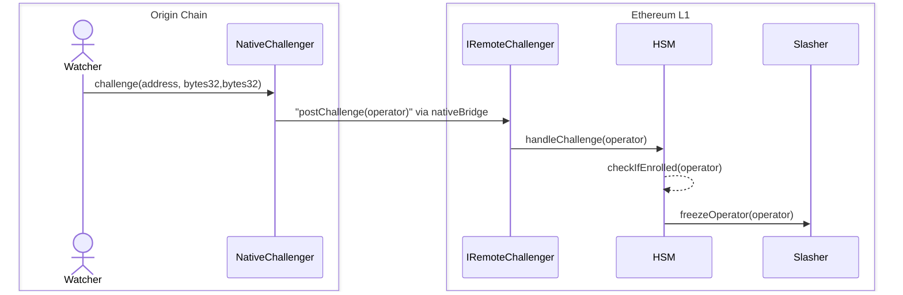

import Tabs from "@theme/Tabs";
import TabItem from "@theme/TabItem";

# Hyperlane AVS

### 概述

欢迎阅读 Hyperlane AVS 文档。本指南将帮助您了解构建在 EigenLayer（以太坊再质押协议）之上的 Hyperlane 的 AVS（主动验证服务）模块。

Hyperlane 目前采用权威证明模型来保障安全性，其中由受信任的验证者群体被选择来维护[安全性](/docs/protocol/ISM/multisig-ISM.mdx)。然而，如果任何验证者错误签名或带有恶意意图，由于这些验证者没有经济质押，因此不会受到任何惩罚。这正是 AVS 模块旨在解决的问题。

```mermaid
flowchart TB
    subgraph Ethereum
      Staker
      Operator
      EL[EigenLayer]
      H_AVS[Hyperlane AVS]
      CH1[Challenger1]
      CH2[Challenger2]
      CH3[Challenger3]

      Operator -- "(de)register()" --> H_AVS
      Staker -- "deposit(operator)" --> EL

      H_AVS <-..-> EL
      CH1 -. "handleChallenge(operator)" .-> H_AVS
      CH2 -. "handleChallenge(operator)" .-> H_AVS
      CH3 -. "handleChallenge(operator)" .-> H_AVS

      style H_AVS fill: #FF0099
      style EL fill: #1a0c6d
      style CH1 fill: #006400
      style CH2 fill: #006400
      style CH3 fill: #006400
    end
```



AVS 模块通过最小的成本来为每个支持的链引导新的验证器网络，从而在 Hyperlane 协议中实现了独特的[经济安全性](/docs/protocol/economic-security/economic-security.mdx)。这是通过利用可以保护来自和在 rollups 之间的出站消息的共享质押池来实现的。这个过程中的主要利益相关者是：

- **运营者** - 选择加入 Hyperlane AVS 服务并开始验证指定链的出站消息的 EigenLayer 运营者
- **质押者** - 将其质押委托给运营者以保护网络的 EigenLayer 质押者
- **应用程序** - 利用 Hyperlane 寻求跨链消息经济安全性的应用程序

:::caution

EigenLayer 尚未启用惩罚和奖励支付。除了 AVS 之外，还必须在[跨链安全模块 (ISM)](/docs/protocol/ISM/modular-security.mdx)中设置签名和验证。

:::

### 架构



上述类图描述了当前 AVS 模块合约的架构。最重要的是，它描述了我们通过 `IRemoteChallenger` 接口支持的 _"metaAVS"_ 设计模式。

### `IRemoteChallenger`

Hyperlane 的运营者可以灵活地在其选择的链上运营，使 AVS 模块可以适应任何链或挑战者。然而，这种灵活性可能导致在主网上缺乏普遍接受的"规范"真相来源用于惩罚。这是因为欺诈只能在源链上被证明，因此需要一种方式将该信息传输到持有质押的链上。

秉承无需许可互操作性的理念，我们认为应用程序开发者应该能够定义自己的真相来源，并为其应用程序的经济安全性建立保证。这包括能够编程挑战条件和惩罚窗口。

```solidity
interface IRemoteChallenger {
    /// @notice Returns the number of blocks that must be mined before a challenge can be handled
    /// @return The number of blocks that must be mined before a challenge can be handled
    function challengeDelayBlocks() external view returns (uint256);

    /// @notice Handles a challenge for an operator
    /// @param operator The address of the operator
    function handleChallenge(address operator) external;
}
```

此配置应该是不可变的，并且任何 AVS 运营者都可以查看和选择加入。`handleChallenge` 函数明确编码了您期望如何将来自源链（比如 Arbitrum）的挑战传递到以太坊主网，其中 AVS 合约和 `IRemoteChallenger` 存在。

对于 Arbitrum，它可以是 rollup 的原生桥，对于另一个 L1，它可以是基于委员会的解决方案。我们的接口对挑战者实现是不可知的，以允许在这个设计领域保持灵活性。这允许我们在 L1 上成功执行 `ism.verify()` 后通过调用 `handleChallenge()` 来重用现有的 hook-ISMs 设置。在使用 rollup 的原生桥的情况下，一个合理的 `challengeDelayBlocks` 应该略长于一周。

作为运营者，您需要审查不同的 `IRemoteChallenger` 合约并评估其风险和回报。如果有兴趣，您可以直接从 `HyperlaneServiceManager` 合约中注册一个或多个挑战者。

:::note

IRemoteChallenger 实现尚未在生产环境中上线。

:::

### 注册工作流程

前提条件：运营者必须已注册为 EigenLayer 运营者（通过其 CLI）



运营者需要注册特定的挑战者以允许无需许可的惩罚的经济安全性。作为运营者，您可以检查每个远程挑战者，并根据风险自行选择要加入哪些。这也意味着没有集中式的许可或白名单会成为为不同 rollup 堆栈添加挑战者的瓶颈。运营者可以在取消注册延迟区块过后取消注册。

### 取消注册工作流程



运营者只能在从其注册的所有挑战者中取消注册后才能取消注册自己，每个挑战者都可以有自己的延迟期。这是为了确保运营者在任何挑战者的挑战期过去之前无法提取其质押。

### 质押工作流程



在 EigenLayer 的设计中，质押者的资金是安全的，因为在激活惩罚之前这些资金不会提供给 AVS。这确保没有资金会过早面临风险。此外，该设计不允许用户仅选择加入 Hyperlane AVS，因为质押是通过 StrategyManager 管理并指向特定运营者的。

### 惩罚工作流程



惩罚机制被设计为无需许可和灵活的。`IRemoteChallenger` 接口允许不同的惩罚机制实现。例如，`postChallenge` 函数由源链上的原生挑战者调用，然后调用 `HyperlaneServiceManager` 合约上的 `handleChallenge` 函数。`HyperlaneServiceManager` 合约然后检查运营者是否已注册挑战者，并调用 `Slasher` 合约上的 `freezeOperator` 函数来冻结运营者的质押。

:::note

挑战者和惩罚者合约尚未在生产环境中上线。此序列图可能会根据最终实现而改变。

:::

### 合约部署

<Tabs>
  <TabItem value="ethereum" label="Ethereum" default>  
| Name                                                                                                                                                                              | Proxy                                                                                                                           | Implementation                                                                                                                  |
| --------------------------------------------------------------------------------------------------------------------------------------------------------------------------------- | ------------------------------------------------------------------------------------------------------------------------------- | ------------------------------------------------------------------------------------------------------------------------------- |
| [`ECDSAStakeRegistry`](https://github.com/hyperlane-xyz/hyperlane-monorepo/blob/f0df1a4cd1a9a6ec2e01b106941a2d4e42e5ba18/solidity/contracts/avs/ECDSAStakeRegistry.sol)           | [`0x272CF0BB70D3B4f79414E0823B426d2EaFd48910`](https://etherscan.io/address/0x272CF0BB70D3B4f79414E0823B426d2EaFd48910) | [`0xa11b1a385287b5167ecca6a38f63abeab981d589`](https://etherscan.io/address/0xa11b1a385287b5167ecca6a38f63abeab981d589) |
| [`HyperlaneServiceManager`](https://github.com/hyperlane-xyz/hyperlane-monorepo/blob/f0df1a4cd1a9a6ec2e01b106941a2d4e42e5ba18/solidity/contracts/avs/HyperlaneServiceManager.sol) | [`0xe8E59c6C8B56F2c178f63BCFC4ce5e5e2359c8fc`](https://etherscan.io/address/0xe8E59c6C8B56F2c178f63BCFC4ce5e5e2359c8fc) | [`0x3127e69517ec2268dd5745c97194d387a4fc0c45`](https://etherscan.io/address/0x3127e69517ec2268dd5745c97194d387a4fc0c45) |
  </TabItem>
  <TabItem value="holesky" label="Holesky">
    | Name                                                                                                                                                                              | Proxy                                                                                                                           | Implementation                                                                                                                  |
| --------------------------------------------------------------------------------------------------------------------------------------------------------------------------------- | ------------------------------------------------------------------------------------------------------------------------------- | ------------------------------------------------------------------------------------------------------------------------------- |
| [`ECDSAStakeRegistry`](https://github.com/hyperlane-xyz/hyperlane-monorepo/blob/f0df1a4cd1a9a6ec2e01b106941a2d4e42e5ba18/solidity/contracts/avs/ECDSAStakeRegistry.sol)           | [`0xFfa913705484C9BAea32Ffe9945BeA099A1DFF72`](https://holesky.etherscan.io/address/0xFfa913705484C9BAea32Ffe9945BeA099A1DFF72) | [`0x628bc518ed1e0e8c6cbcd574eba0ee29e7f6943e`](https://holesky.etherscan.io/address/0x628bc518ed1e0e8c6cbcd574eba0ee29e7f6943e) |
| [`HyperlaneServiceManager`](https://github.com/hyperlane-xyz/hyperlane-monorepo/blob/f0df1a4cd1a9a6ec2e01b106941a2d4e42e5ba18/solidity/contracts/avs/HyperlaneServiceManager.sol) | [`0xc76E477437065093D353b7d56c81ff54D167B0Ab`](https://holesky.etherscan.io/address/0xc76E477437065093D353b7d56c81ff54D167B0Ab) | [`0xa3ab7e6ce24e6293bd5320a53329ef2f4de73fca`](https://holesky.etherscan.io/address/0xa3ab7e6ce24e6293bd5320a53329ef2f4de73fca) |
  </TabItem>
</Tabs>
