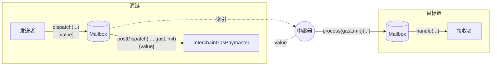

# 跨链 Gas 支付

成功的跨链消息需要两个交易：一个在源链上发送消息，一个在目标链上传递消息。

为了方便起见，Hyperlane 在源链上提供了一个链上接口，允许消息发送者向[中继器](./agents/relayer.mdx)支付[费用](#跨链-gas-支付计算)，以在目标链上传递消息。这种支付被称为跨链 Gas 支付。



## 跨链 Gas 支付主合约

跨链 Gas 支付由 `InterchainGasPaymaster`（IGP）智能合约促成。

这些合约暴露了[跨链 Gas 支付主接口](../reference/hooks/interchain-gas.mdx)，允许消息发送者使用源链上的原生代币向[中继器](./agents/relayer.mdx)支付费用，以支付在目标链上传递消息的成本。

每个 `InterchainGasPaymaster` 合约对应一个中继器。您可以在[地址](../reference/contract-addresses.mdx)下找到 Abacus Works 中继器的地址。

### 跨链 Gas 支付计算

跨链 Gas 支付按以下方式计算：

$$
destinationTxCost = destinationGasPrice * gasLimit
\\[5pt]
exchangeRate = \frac{originGasTokenPrice}{destinationGasTokenPrice}
\\[5pt]
originFee = exchangeRate * destinationTxCost
$$

`gasLimit` 和 `exchangeRate` 分别由消息发送者和中继器配置。

### Gas 限制

Gas 限制是根据在目标链上调用给定消息的 `handle` 的成本设置的。这可能因消息内容和处理程序的逻辑而异。消息发送者应根据处理消息的预期成本配置 Gas 限制，当未配置 Gas 限制时，将使用默认值。

有关更多详细信息，请参阅[跨链 Gas hook 参考](../reference/hooks/interchain-gas.mdx#post-dispatch)。

### 目标 Gas 配置

对于每个远程域，InterchainGasPaymaster 设置域 Gas 配置。

```solidity
struct DomainGasConfig {
    IGasOracle gasOracle;
    uint96 gasOverhead;
}
```

#### Gas 开销

Gas 开销作为目标 Gas 配置的一部分设置。这对应于在目标链上处理消息的运营成本。

:::note
您应确保 `gasOverhead` 足以覆盖目标链上不同 ISM 的范围。

由于您可以为不同的消息类型配置不同的 ISM，每个 ISM 的 `verify` 函数可能有不同的 Gas 开销。
:::

#### Gas 预言机

为了支持[跨链 Gas 支付主接口](../reference/hooks/interchain-gas.mdx)，IGP 合约可以配置 Gas 预言机，负责跟踪远程代币 Gas 价格和汇率。

这使得 `quoteGasPayment` 函数能够提供远程链上 Gas 价格的准确报价，以本地链的原生代币计价。

:::tip
`quoteGasPayment` 函数在计算传递消息的报价时会考虑目标链的 `gasOverhead`。
:::

最终，中继器将能够自动更新其 Gas 预言机，以确保其 IGP 始终为远程 Gas 报出公平的价格。

## 信任假设

跨链 Gas 支付基于消息发送者和中继器之间的社会契约。

换句话说，中继器可能会收到跨链 Gas 支付而不传递相应的消息。

因此，在进行跨链 Gas 支付时，建议使用与已知且信誉良好的中继器相关联的 IGP 合约。

诚实的中继器实现将兑现其 IGP 收到的任何成功的 Gas 支付，无论实际支付了多少代币。通过保持[Gas 预言机](../reference/hooks/interchain-gas.mdx)的更新，中继器可以确保仅在支付了"公平"价格时 Gas 支付才会成功。
