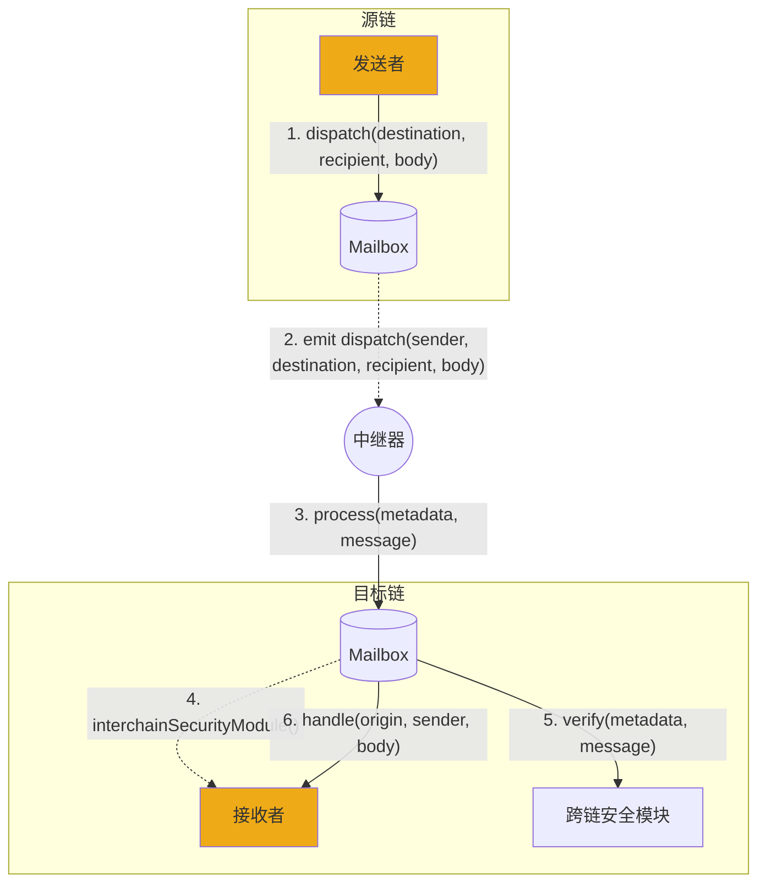

# 协议概述

Hyperlane 是第一个[无需许可的互操作性](../deploy-hyperlane.mdx)层，允许智能合约开发者在区块链之间发送任意数据。

开发者可以使用 Hyperlane 来转移代币、执行函数调用，以及许多其他功能，这些功能使得创建跨链应用成为可能，用户可以在任何区块链上访问这些应用。

用户通过 [mailbox](./mailbox.mdx) 智能合约与 Hyperlane 协议进行交互，这些合约提供了一个链上消息接口，用于发送和接收跨链消息。

Hyperlane 采用模块化的安全方法，允许应用程序配置和选择[跨链安全模块](../protocol/ISM/modular-security.mdx)（ISM）。应用程序可以指定一个 ISM 来自定义安全模型，以保护其与 Hyperlane 消息接口的集成。

