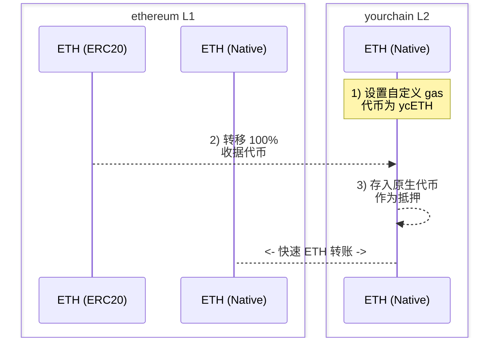

# Warp Routes：通过自定义 Gas 代币实现快速原生转账

本文档将指导你如何使用 Hyperlane 通过自定义 gas 代币实现与你的 L2 之间的快速原生转账。

# 主要动机

1. 在你选择的 L2 上创建自定义 gas 代币。
2. 使用这个 gas 代币实现快速原生转账，而不是通过规范桥等待较长的结算时间。

# 前置条件

要完成以下演练，你应该准备：

1. 一个 L2 网络（"yourchain"），你可以在其上指定[自定义 gas 代币](https://docs.arbitrum.io/launch-orbit-chain/how-tos/use-a-custom-gas-token)，并希望实现与其之间的快速原生转账。
2. 一个唯一的部署者或授权所有者，用于接收收据代币的铸造（关于这个代币的更多信息见下文）。
3. 已安装 [Hyperlane CLI](https://docs.hyperlane.xyz/docs/reference/cli) 实例，并将钱包私钥设置为 `HYP_KEY` 环境变量，且在所有相关网络上都有资金。

# 演练：快速原生转账

:::info
注意，下文中的"收据代币"是一个（一次性）可铸造的"虚拟"代币，用于在 yourchain 对应的 L1 上对 warp-route 进行抵押。你将在创建它之后销毁铸造权限。

另外，根据你的 L2，你的自定义 gas 代币的代币符号可能会被分配与你的收据代币相同的符号。如果在以太坊上部署，你可能想要将符号设置为 `ETH`。
:::

## 步骤

### 1) 部署收据代币

在以太坊上部署一个 `ETH` 收据代币，作为你的 L2 的自定义 gas 代币。

1. 例如，你可以使用已有资金的钱包通过 [Remix](https://remix.ethereum.org/) 部署你的收据代币，合约类似如下：

    ```solidity
    // SPDX-License-Identifier: MIT
    pragma solidity ^0.8.20;

    import "@openzeppelin/contracts/token/ERC20/ERC20.sol";

    contract YourchainETH is ERC20 {
        constructor() ERC20("YourchainETH", "ETH") {
            _mint(msg.sender, 10000000 * (10 ** 18));
        }
    }
    ```

2. 确保你的 `ETH` 收据代币的全部供应量都铸造给部署者或选定的授权地址。这必须是一次性的铸造事件，以避免稀释下面的以太坊 ↔ yourchain 原生 warp route 的价值。
3. 部署后，保存合约地址以供下面使用。

### 2) 设置自定义 Gas 代币

在 yourchain 上将新部署的 `ETH` ERC20 收据代币设置为自定义 gas 代币。

1. 使用 OP stack 设置自定义 gas 代币：https://docs.optimism.io/builders/chain-operators/features/custom-gas-token
2. 使用 arbitrum orbit 设置自定义 gas 代币：https://docs.arbitrum.io/launch-orbit-chain/how-tos/use-a-custom-gas-token

### 3) 转移所有收据代币

使用你的 L2 的规范桥将 100% 的 `ETH` 收据代币从以太坊转移到 yourchain。

1. 使用 OP stack 标准桥进行转移：https://docs.optimism.io/builders/app-developers/bridging/standard-bridge
2. 使用 arbitrum orbit 桥进行转移：https://docs.arbitrum.io/launch-orbit-chain/how-tos/add-orbit-chain-to-bridge-ui

### 4) 部署原生 Warp Route

使用 Hyperlane CLI，部署以太坊 `ETH` EvmHypNative ↔ yourchain `ETH` EvmHypNative warp route：

1. 运行 `hyperlane warp init` 并完成以下流程：
    1. 使用空格选择 `ethereum` 和 `yourchain`，然后按回车。
    2. 对于以太坊，选择 `native` 并接受 mailbox。
    3. 对于 yourchain，选择 `native` 并接受 mailbox。
2. 在执行部署之前，确保 yourchain 的 `metadata.yaml` 已定义 `blockExplorers` 字段。这对于合约验证是必需的，以便轻松地对 yourchain 的 warp route 进行抵押。
3. 运行 `hyperlane warp deploy` 并确认 warp 部署配置符合预期。
4. 执行后，你的 `yourchain-ethereum-config.yaml` 部署文件将类似于以下内容：

    ```solidity
    # yaml-language-server: $schema=../schema.json
    tokens:
      - addressOrDenom: "0x3e5bB1a03fef5DB15A320885E6A0C8Bff8b656bd"
        chainName: yourchain
        connections:
          - token: ethereum|ethereum|0x6d64832bDB4F04721D4F23CCbF17326cb636101e
        decimals: 18
        name: Ether
        standard: EvmHypNative
        symbol: ETH
      - addressOrDenom: "0x6d64832bDB4F04721D4F23CCbF17326cb636101e"
        chainName: ethereum
        connections:
          - token: ethereum|yourchain|0x3e5bB1a03fef5DB15A320885E6A0C8Bff8b656bd
        decimals: 18
        name: Ether
        standard: EvmHypNative
        symbol: ETH
    ```

### 5) 为你的 Warp Route 提供抵押

通过 `receive()` 函数将 yourchain `ETH` 作为抵押存入 yourchain 的原生 warp route。如果需要，你可以使用已验证的合约通过你的扫描器 UI 或像 Metamask 这样的钱包来完成此操作。

这为原生 warp route 提供抵押，使用户能够快速地在 yourchain 之间桥接他们的原生资产。

### 6) 测试

你可以使用以下命令发起一个单个 wei 的测试转账：

```bash
hyperlane warp send --relay --symbol ETH
```

`--relay` 标志是可选的，它会将消息中继到目标链。

你也可以在后台运行一个仅为你的 warp route 传递的中继器：
```bash
hyperlane relayer --symbol TOKEN
```

:::tip
默认情况下，你的 warp core 配置位于本地注册表的 `$HOME/.hyperlane/deployments/warp_routes` 中，可以与 `--warp` 标志一起使用。
:::

你可以在设置了 warp route 的任意方向之间进行测试。

**🎉 恭喜！你现在已经通过在你的 L2 上的自定义 gas 代币实现了与 yourchain 之间的快速原生转账。**



:::warning
请注意，这种抵押策略需要承担某些 ISM 信任假设。
:::

:::info
看看 inEVM bridge 以查看这些 warp routes 的实际应用示例：https://bridge.inevm.com/
:::

---

查看由 Hyperlane 支持团队和 Injective 发布的其他信息：

→ [inEVM 聚焦：Hyperlane](https://blog.injective.com/en/inevm-spotlight-hyperlane-2/)

→ [连接 Injective：Hyperlane 开通 inEVM Bridge](https://medium.com/hyperlane/connecting-injective-hyperlane-opens-the-inevm-bridge-6f1d3edf0ff8)

→ [Hyperlane 和 Injective | 扩展机遇](https://medium.com/@kobriyyu/hyperlane-and-injective-expanding-opportunities-8ce170b72da7)
