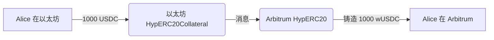

# Warp Routes：示例用法

本节描述了各种 warp route 类型的组合。

## Warp Route 组合

### 1. 原生到原生

此路由允许在两个都使用自己的原生代币的链之间转移原生代币。

:::info
这种类型的路由仅应在两个网络都具有等值的原生代币时使用，例如 inEVM 和以太坊。
:::

**设置：**

- 在两条链上部署 HypNative 合约。

**示例流程：**

```
从：以太坊（ETH）
到：inEVM（ETH）
金额：1 ETH
```

**图示：**


**用例：** Alice 想要快速将价值从以太坊转移到 inEVM。

---

### 2. 原生到合成

此路由在另一条链上创建原生代币的合成表示。

**设置：**

- 在原生代币链上部署 HypNative 合约。
- 在其他链上部署 HypERC20（合成）合约。

**示例流程：**

```
从：Celo（CELO）
到：Optimism（wCELO）
金额：100 CELO
```

**图示：**


**用例：** 一个基于 Celo 的项目想要让他们的原生 CELO 代币在 Optimism 上可用。

---

### 3. 抵押到合成

此路由允许基于抵押的 ERC20 代币创建合成代币。

**设置：**

- 在 ERC20 链上部署 HypERC20Collateral 合约。
- 在其他链上部署 HypERC20（合成）合约。

**示例流程：**

```
从：以太坊（USDC）
到：Arbitrum（wUSDC）
金额：1000 USDC
```

**图示：**



**用例：** Alice 想要在 Arbitrum 上使用她的 USDC，而不需要将实际的 USDC 转移到 Arbitrum 或依赖 Arbitrum 的桥接 USDC。
