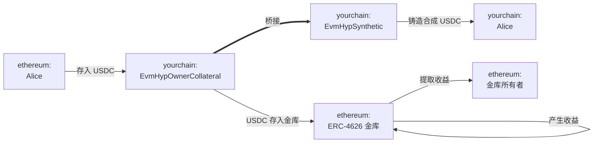
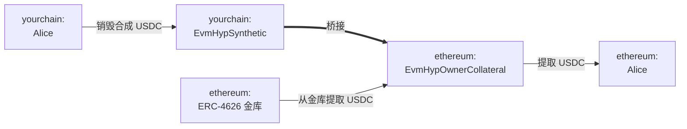

# 部署收益路由

本指南的目的是说明如何使用 Hyperlane warp routes 创建产生收益的桥接，通过随时间复利来确保闲置的桥接资产能够产生收益。根据不同的变体（详见下文），收益将分配给收益路由所有者或用户。

## 前置条件

要完成以下演练，你需要准备：

1. 一个你想要部署收益路由的源网络和目标网络。
2. 源网络上的一个 [ERC-4626 金库](https://ethereum.org/en/developers/docs/standards/tokens/erc-4626/) 地址，用于产生收益。该金库的基础资产将被设置为 warp route 的抵押品（例如，如果金库是 USDC 资金，则 warp route 也将支持 USDC 转账）。
3. 已安装 [Hyperlane CLI](https://docs.hyperlane.xyz/docs/reference/cli) 实例，并将钱包私钥设置为 `HYP_KEY` 环境变量，且在你的源网络和目标网络上都有资金。

## 演练

### 概念

- **ERC-4626 金库**：以太坊标准的代币化收益金库。存款时，会铸造代表基础资产所有权的份额代币。
- **收益路由（EvmHypOwnerCollateral & EvmHypSynthetic）**：Hyperlane 对收益型 EVM 抵押代币的表示。注意，收益路由的金库的存入资产地址被用作 warp routes 的抵押代币。
    - 这种特定的收益路由变体将金库收益分配给**所有者**。还有一种替代设置，收益分配给用户（EvmHypCollateral & EvmHypSyntheticRebase）。在本指南的大部分内容中，我们将参考前者。概念保持不变。

:::info
在本演练中，"源"网络指的是产生收益的网络（例如，以太坊有一个可以获得收益的 USDC 借贷金库。在目标链 yourchain 上铸造合成 USDC）。
:::

以下是以太坊和 yourchain 之间的桥接流程

**桥接 USDC：ethereum → yourchain**

在这个例子中，Alice 想要在以太坊和 yourchain 之间桥接 USDC。收益路由会将她的 USDC 转入一个有收益的 ERC-4626 金库，然后在 yourchain 上为她铸造合成 USDC。注意，收益路由所有者可以领取该金库产生的收益。

**桥接 USDC：yourchain → ethereum**

当 Alice 想要桥接回以太坊时，会发生相反的过程。收益路由将销毁她的合成 USDC，从以太坊的金库中提取 USDC，并将 USDC 返还给她。

### 收益路由部署步骤

使用 Hyperlane CLI，在以太坊和 yourchain 上分别部署 USDC EvmHypOwnerCollateral 和 EvmHypSynthetic 代币：
    1. 运行 `hyperlane warp init` 生成 warp route 配置：
        1. 使用空格选择 `yourchain` 和 `ethereum`，然后按回车。
        2. 对于以太坊，选择 `collateralVault`，接受 mailbox，并输入 yourchain 上的 USDC 金库地址。
            - 或者，你可以选择 `collateralVaultRebase`，这是一个通过增加用户持有量来分配收益给用户的收益路由变体。
        3. 对于 yourchain，选择 `synthetic` 并接受 mailbox。
            - 如果你选择了 `collateralVaultRebase`，你必须将其与 `syntheticRebase` 配对
    2. 运行 `hyperlane warp deploy` 部署 warp route。

有关这些步骤的更详细信息，请参考[桥接代币](/docs/guides/deploy-warp-route)指南。

### 领取收益
根据收益路由变体的不同，可以通过调用各自合约的 `HypERC4626OwnerCollateral.sweep()` 或 `HypERC4626Collateral.rebase()` 来领取收益。

**🎉 恭喜！你现在已经用你的金库创建了一个新的收益路由。桥接的用户资产现在可以在源 warp route 中赚取被动收益。**

:::warning
请注意，这种抵押策略需要承担某些 ISM 信任假设，并且存在基础 [ERC-4626 金库](https://ethereum.org/en/developers/docs/standards/tokens/erc-4626/) 抵押不足的固有风险。
:::

---

查看由 Hyperlane 支持团队、Cheese Chain 和以太坊基金会发布的其他信息：

→ [Hyperlane：介绍收益路由](https://medium.com/hyperlane/introducing-yield-routes-f7e8fd091443)

→ [ERC-4626 代币化金库标准](https://ethereum.org/en/developers/docs/standards/tokens/erc-4626/)
