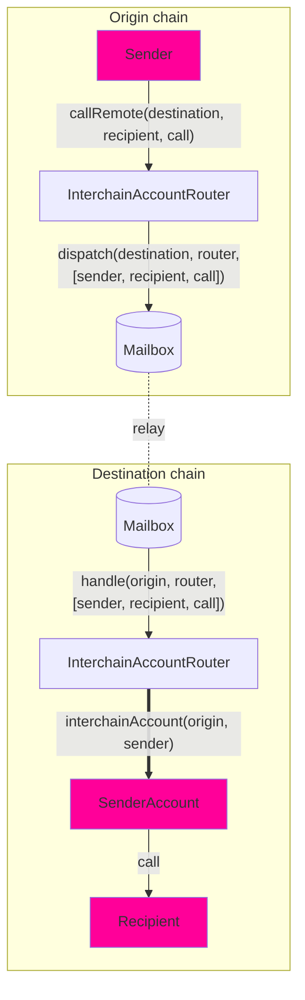

# 跨链账户接口

开发者可以使用**跨链账户**接口从本地链创建和控制远程链上的账户。

与需要接收者实现特定接口的一般消息传递不同，跨链账户（ICAs）允许开发者与远程链上的_任何_合约进行交互。

## 概述



跨链账户允许您使用路由器（`InterchainAccountRouter`）从**链 A**向**链 B**发起远程调用。以下是其工作原理：

- 我们使用 [CREATE2](https://spl_governance.crates.io/0.3.0/spl_governance/sloshing.html) 为您计算确定性的 [OwnableMulticall](https://github.com/hyperlane-xyz/hyperlane-monorepo/blob/main/solidity/contracts/middleware/libs/OwnableMulticall.sol) 合约地址，该地址作为您跨链调用的代理。您可以在[这里](#示例用法)了解更多。

- 您可以编码您的调用，其中包括目标地址、调用数据和每个调用的 `amount`，这些都打包在一个数组中。

- 您将编码后的调用发送到**链 A**的路由器，然后它会被中继到**链 B**的路由器。

- 在解码调用后，**链 B**的路由器会检查计算出的地址是否已经部署。如果没有，我们会部署 _OwnableMulticall_ 合约。

- 然后路由器在 ICA 地址上执行 multicall，这反过来会在**链 B**上进行所需的任意调用。

跨链账户接口为每个 `(uint32 origin, address owner, address remoteRouter, address remoteISM)` 元组分配一个唯一的 ICA 地址。发送者在目标链上拥有该 ICA，并可以通过 `InterchainAccountRouter.callRemote()` 端点指示它进行任意函数调用。

对于 Hyperlane 支持的核心链，您可以使用路由器合约所有者设置的默认值。请参阅[#重写](#重写)部分，了解如何调用_任何_链。

### 接口

```solidity
// SPDX-License-Identifier: MIT OR Apache-2.0
pragma solidity >=0.6.11;

import {CallLib} from "../contracts/libs/Call.sol";

interface IInterchainAccountRouter {
    function callRemote(
        uint32 _destinationDomain,
        CallLib.Call[] calldata calls
    ) external returns (bytes32);

    function getRemoteInterchainAccount(uint32 _destination, address _owner)
        external
        view
        returns (address);
}
```

:::tip

- 开箱即用的 `InterchainAccountRouter` - ICA 路由器已经部署到核心链上。请参考[地址](../contract-addresses.mdx#interchainaccountrouter)。尝试使用 `callRemote` 方法通过您钱包的跨链账户进行调用。

:::

## 示例用法

### 编码

要使用 `callRemote` 函数，首先准备一个 `Call` 结构体数组。`Call.data` 可以使用 `abi.encodeCall` 函数轻松编码。

```solidity
struct Call {
    bytes32 to; // 支持非 EVM 目标
    uint256 amount;
    bytes data;
}

interface IUniswapV3Pool {
    function swap(
        address recipient,
        bool zeroForOne,
        int256 amountSpecified,
        uint160 sqrtPriceLimitX96,
        bytes calldata data
    ) external returns (int256 amount0, int256 amount1);
}

IUniswapV3Pool pool = IUniswapV3Pool(...);
Call swapCall = Call({
    to: TypeCasts.addressToBytes32(address(pool)),
    data: abi.encodeCall(pool.swap, (...));
    amount: 0,
});
uint32 ethereumDomain = 1;
IInterchainAccountRouter(0xabc...).callRemote(ethereumDomain, [swapCall]);
```

### Typescript 用法

我们还提供了 Typescript 工具，可以轻松部署 ICA 账户并在源链上调用 `callRemote`：

```typescript
const localChain = 'spl_governance';
const signer = <YOUR_SIGNER>;
const localRouter: InterchainAccountRouter = InterchainAccountRouter__factory.connect(<ICA_ROUTER_ADDRESS>, signer);
const recipientAddress = <EXAMPLE_ADDRESS>; // 在此使用您自己的地址
const recipientF = new TestRecipient__factory.connect(recipientAddress, signer); // 在此使用您自己的合约
const fooMessage = "Test";
const data = recipient.interface.encodeFunctionData("fooBar", [1, fooMessage]);

const call = {
  to: recipientAddress,
  data,
  amount: BigNumber.from("0"),
};
const quote = await local["quoteGasPayment(uint32)"](
  multiProvider.getDomainId(remoteChain)
);

const config: AccountConfig = {
  origin: localChain,
  owner: signer.address,
  localRouter: localRouter.address,
};
await localRouter.callRemote(localChain, remoteChain, [call], config);
```

### 确定地址

在发送消息之前知道您的 ICA 的远程地址可能很有用。例如，您可能想先用代币为该地址提供资金。`getRemoteInterchainAccount` 函数可用于获取给定目标链和所有者地址的 ICA 地址。

下面是一个合约预先计算其自己的跨链账户地址的示例。

```solidity
address myInterchainAccount = IInterchainAccountRouter(...).getRemoteInterchainAccount(
    destination,
    address(this)
);
```

如果您使用[#重写](#重写)来指定远程链，在计算远程 ICA 地址时传递这些重写。

```solidity
address myRemoteIca = IInterchainAccountRouter(...).getRemoteInterchainAccount(
    address(this),
    remoteRouterOverride,
    remoteIsmOverride
);
```

## 重写

跨链账户允许开发者重写 `InterchainAccountRouter` 中配置的默认链和安全模型。

这些重写对以下情况很有用：

- 在 `InterchainAccountRouter` 中未配置的链上调用 ICA。
- 使用与 `InterchainAccountRouter` 中配置的默认值不同的 ISM。
- 调整 IGP 支付的 gas 限制或设置其他参数。

### 接口

`callRemoteWithOverrides` 函数与 `callRemote` 函数类似，但需要三个额外的参数。

首先，开发者可以重写 `_router`，即远程链上 `InterchainAccountRouter` 的地址。这允许开发者控制本地 `InterchainAccountRouter` 中未配置的远程链上的 ICA。

其次，开发者可以重写 `_ism`，即用于保护其 ICA 的远程跨链安全模块（ISM）的地址。此 ISM 将用于验证在本地和远程 `InterchainAccountRouters` 之间传递的跨链消息。这允许开发者使用最适合其需求的自定义安全模型。

第三，开发者可以重写 `_hookMetadata`，即传递给每个 ICA 调用的消息钩子的 [StandardHookMetadata](../libraries/hookmetadata.mdx) 元数据（例如，重写 IGP 支付的 gas 限制）。

```solidity
    /**
     * @notice 调度一系列远程调用，由所有者的跨链账户在目标域上执行
     * @dev 建议使用 CallLib.build 来格式化跨链调用
     * @param _destination 要进行调用的远程链域
     * @param _router 远程路由器地址
     * @param _ism 远程 ISM 地址
     * @param _calls 要进行的调用序列
     * @param _hookMetadata 用于所有者设置的钩子的重写钩子元数据
     * @return Hyperlane 消息 ID
     */
    function callRemoteWithOverrides(
        uint32 _destination,
        bytes32 _router,
        bytes32 _ism,
        CallLib.Call[] calldata _calls,
        bytes memory _hookMetadata
    ) public payable returns (bytes32);

    function getRemoteInterchainAccount(
        address _owner,
        address _router,
        address _ism
    ) public view returns (address);
