# Arbitrum L2 到 L1 Hook

Arbitrum 的 Outbox 系统允许在乐观挑战期后进行任意的 L2 到 L1 合约调用，即在 L2 链上发起的消息最终会在 L1 上执行。更多详情请参见[此处](https://docs.arbitrum.io/how-arbitrum-works/arbos/l2-l1-messaging)。Hyperlane 可以包装 Outbox 系统，利用 Arbitrum L2 的乐观安全性（7 天提款期和运营欺诈证明）来保护来自任何 Arbitrum Nitro rollups 的 L2 到 L1 消息的安全。我们已经实现了 [ArbL2ToL1Hook](https://github.com/hyperlane-xyz/hyperlane-monorepo/blob/main/solidity/contracts/hooks/ArbL2ToL1Hook.sol) 和 [ArbL2ToL1Ism](https://github.com/hyperlane-xyz/hyperlane-monorepo/blob/main/solidity/contracts/isms/hook/ArbL2ToL1Ism.sol)。

## 工作原理

:::note

来自 L2 的外发消息无法提供协议内的自动 L1 执行，因为以太坊不通过 L1 节点提供计划执行功能。

:::

`ArbL2ToL1Hook` 将带有 `messageId` 的编码函数调用发送到 L2 上的 `ArbSys` 预编译合约。在等待提款期后，您可以在 L2 上调用 `getOutboxProof()` 来获取消息的默克尔证明。从这里开始，您有两个选择：

- **选项 A：** 您可以通过 `mailbox.process()` 调用来调用 `ArbL2ToL1Ism` 的验证函数，并附带证明和其他编码数据，这反过来会调用 `outbox.executeTransaction()`，检查消息发送者和消息数据的有效性。
- **选项 B：** 您可以直接使用证明和其他编码数据调用 `outbox.executeTransaction()`。但是，您需要再次调用 `ArbL2ToL1Ism` 的验证函数来传递消息。这个选项也允许向接收者合约传递消息值。

### 选项 A

```mermaid
flowchart TB
    subgraph Origin L2[源 L2]
      Sender[发送者]
      M_O[(Mailbox)]
      Hook[ArbL2ToL1Hook]
      L_2[(ArbSys)]

      Sender -- "dispatch(...)" --> M_O
      M_O -- "postDispatch(message)" --> Hook
      Hook -- "sendMessage(messageId)" --> L_2
    end

    M_O -. "process (中继器)
    7 天后" .-> M_D
    L_2 -. "exeuteTransaction(第三方中继器)
    7 天后" .-> L_1

    subgraph Destination L1[目标 L1]
      Recipient[接收者]
      M_D[(Mailbox)]
      ISM{ArbL2ToL1Ism}
      L_1[(ArbOutbox)]

      M_D -- "verify(..., message)" --> ISM
      M_D -- "handle(...)" --> Recipient
      ISM -. "interchainSecurityModule()" .- Recipient

      L_1 
    end

    style L_1 fill:#162c4f
    style L_2 fill:#162c4f
```

### 选项 B

注意：在这里，中继器负责从 `arbSys.getOutboxProof()` 编码消息证明并调用 `outbox.executeTransaction()` 函数。

```mermaid
flowchart TB
    subgraph Origin L2[源 L2]
      Sender[发送者]
      M_O[(Mailbox)]
      Hook[ArbL2ToL1Hook]
      L_2[(ArbSys)]

      Sender -- "dispatch(...)" --> M_O
      M_O -- "postDispatch(message)" --> Hook
      Hook -- "sendMessage(messageId)" --> L_2
    end

    M_O -. "process(中继器)
    7 天后" .-> M_D
    M_O -. "getOutboxProof()" .-> L_2

    subgraph Destination L1[目标 L1]
      Recipient[接收者]
      M_D[(Mailbox)]
      ISM{ArbL2ToL1Ism}
      L_1[(ArbOutbox)]

      M_D -- "verify(..., message)" --> ISM
      M_D -- "handle(...)" --> Recipient
      ISM -. "interchainSecurityModule()" .- Recipient

      L_1 -- "verifyMessageId(messageId)" --> ISM
    end

    style L_1 fill:#162c4f
    style L_2 fill:#162c4f
```

