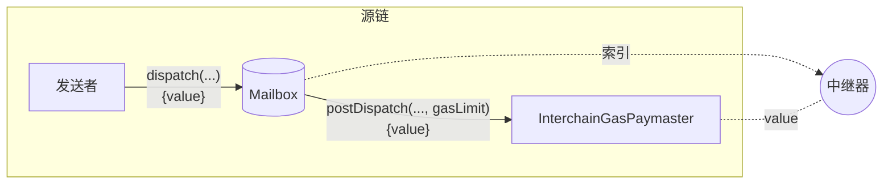
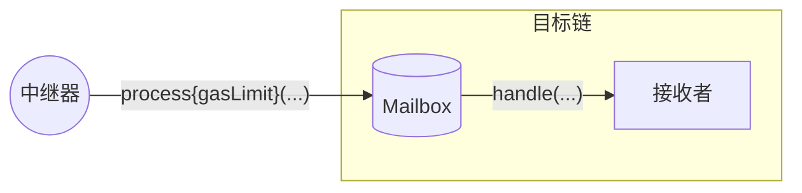

import Tabs from '@theme/Tabs';
import TabItem from '@theme/TabItem';

# 跨链 Gas 支付

要[传递消息](../messaging/receive.mdx)，必须在目标链上包含一个交易，该交易使用编码的消息和 ISM 元数据调用 Mailbox 的 `process` 函数。



为了方便起见，[中继器](../../operate/relayer/run-relayer.mdx)会监视已发送的消息，如果在源链上收到足够的支付，就会代表消息发送者提交处理交易。我们将此称为*跨链 gas 支付*。



由于消息可以触发任意代码执行，中继器必须使用 `gasLimit` 来限制 [`handle` 调用](../messaging/receive.mdx#handle)，以便在消息发送时适当收费。

$$
destinationTxCost = destinationGasPrice * gasLimit
\\[5pt]
exchangeRate = \frac{originGasTokenPrice}{destinationGasTokenPrice}
\\[5pt]
originFee = exchangeRate * destinationTxCost
$$

## 目标链 Gas 配置

对于每个远程域，您可以设置域 gas 配置。

```solidity
struct DomainGasConfig {
    IGasOracle gasOracle;
    uint96 gasOverhead;
}
```

### gasOracle

`gasOracle` 是一个包含支持的源链和目标链之间汇率的合约。

### gasOverhead

`gasOverhead` 是在目标链上处理消息的运营成本。当返回发送消息的成本报价时，IGP 合约会将此 `gasOverhead` 添加到 `gasLimit` 中。

## 发送后处理

在发送后 hook 期间，如果支付不足以支付中继器的*预期*成本，`InterchainGasPaymaster` 合约将回滚。中继器将遵守 `dispatch` 时的报价。

### Gas 限制

当未指定时，用于限制 `handle` 调用的 `gasLimit` 使用静态默认值 `50_000`。

:::tip
我们建议开发者在单元测试中对其 [`handle` 实现](../messaging/receive.mdx#handle)进行基准测试，以确定合理的 `gasLimit`。
:::

如果您预计 `handle` 函数将消耗超过此默认值的 gas，您应该在[元数据中覆盖默认 `gasLimit`](#metadata)。

### 元数据

此 hook 期望元数据采用 `StandardHookMetadata` 的**打包编码**。有关如何传递元数据覆盖，请参见 Mailbox 的[dispatch 重载](../messaging/send.mdx#overriding-default-hook-metadata)。

<Tabs groupId="lang">
<TabItem value="sol" label="Solidity">

```solidity
struct StandardHookMetadata {
    uint16 variant;
    uint256 msgValue;
    uint256 gasLimit;
    address refundAddress;
}
```

#### 示例

```solidity
bytes memory metadata = abi.encodePacked(
  StandardHookMetadata({
    variant: 1,               // 此 hook 仅支持此变体
    msgValue: 0,              // 此 hook 未使用
    gasLimit: 100000,         // 覆盖默认 gas 限制
    refundAddress: msg.sender // 覆盖默认退款地址
  })
);
```

</TabItem>
</Tabs>

## Gas 预言机

跨链 gas 支付要求使用预言机化的 gas 价格和支持的源链与目标链之间的汇率来计算。

:::info
汇率和 gas 价格由中继器决定。可能会收取价差以应对价格波动和运营成本。
:::

<Tabs groupId="lang">
<TabItem value="sol" label="Solidity">

```solidity
function getExchangeRateAndGasPrice(
    uint32 _destinationDomain
)
    public
    view
    override
    returns (uint128 tokenExchangeRate, uint128 gasPrice)
{
    IGasOracle _gasOracle = destinationGasConfigs[_destinationDomain]
        .gasOracle;

    if (address(_gasOracle) == address(0)) {
        revert(
            string.concat(
                "Configured IGP doesn't support domain ",
                Strings.toString(_destinationDomain)
            )
        );
    }
    return _gasOracle.getExchangeRateAndGasPrice(_destinationDomain);
}
```

**参数**

- `destinationDomain`：消息的目标域

**返回值**
- `tokenExchangeRate`：源链和目标链 gas 代币之间的汇率
- `gasPrice`：目标链的 gas 价格

</TabItem>
</Tabs>

`quoteGasPayment` 函数计算中继器预期成本的费用。

<Tabs groupId="lang">
<TabItem value="sol" label="Solidity">

```solidity
function quoteGasPayment(
    uint32 _destinationDomain,
    uint256 _gasLimit
) public view virtual override returns (uint256) {
    // 获取目标域的 gas 数据
    (
        uint128 _tokenExchangeRate,
        uint128 _gasPrice
    ) = getExchangeRateAndGasPrice(_destinationDomain);

    // 以目标链原生代币计价的总成本
    uint256 _destinationGasCost = _gasLimit * uint256(_gasPrice);

    // 转换为本地原生代币
    return
        (_destinationGasCost * _tokenExchangeRate) /
        TOKEN_EXCHANGE_RATE_SCALE;
}
```

**参数**
- `destinationDomain`：消息的目标域
- `gasLimit`：用于限制 `handle` 调用的 gas 限制

**返回值**
- `fee`：`postDispatch` 成功所需的支付金额

</TabItem>
</Tabs>

## 重试

如果 `handle` 调用消耗的 gas 超过报价，中继器将不会提交处理交易。在这种情况下，可以使用 `payForGas` 函数支付额外的 gas。

<Tabs groupId="lang">
<TabItem value="sol" label="Solidity">

```solidity
function payForGas(
    bytes32 _messageId,
    uint32 _destinationDomain,
    uint256 _gasAmount,
    address _refundAddress
) external payable;
```

**参数**
- `messageId`：从 `dispatch` 调用返回的消息标识符
- `destinationDomain`：消息的目标域
- `gasAmount`：要支付的额外 gas 数量
- `refundAddress`：退还多余支付的地址

</TabItem>
</Tabs>
