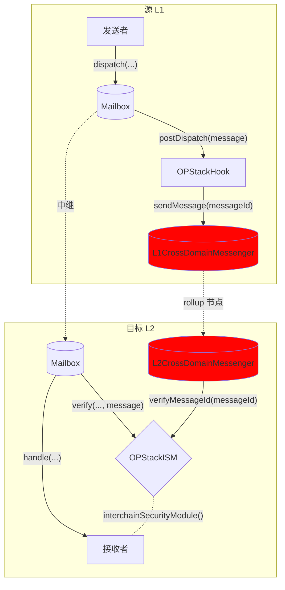

# OP Stack Hook

Optimism 和其他 [OP Stack](https://stack.optimism.io/) rollups 有自己的 L1 和 L2 之间的消息传递接口，称为 `CrossDomainMessenger`。通过此接口传递的消息受益于 rollup [结算层](https://stack.optimism.io/docs/understand/landscape/#execution)的安全性。

```solidity
function sendMessage(
    address _target,
    bytes calldata _message,
    uint32 _gasLimit
) external payable;
```

为了在 Hyperlane 中提供这种安全性选项，我们创建了一个 Hook 和 ISM 组合，可以透明地配置以重用原生 OP Stack 接口。

有关 Hook 和 ISM 地址，请参见[地址](../contract-addresses.mdx)页面。

## 工作原理

OPStackHook 将 messageId 发送到 L1CrossDomainMessenger，后者将其注册为带有 ETH 存款和消息数据的 Optimism `TransactionDeposited` 事件，这些数据会被 rollup 节点获取。
rollup 节点调用预编译合约 `L2CrossDomainMessenger` 的 relayMessage 函数，该函数反过来调用配置的 OptimismISM 合约，将 messageId 设置在 verifiedMessageId 映射中，指向原始的 L1 发送者（即用户）。中继器只携带消息而没有元数据，等待 Optimism 节点进行获取并对 Optimism 进行存储写入，然后消息传递就得到验证。


