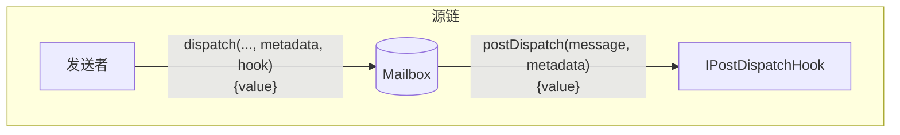
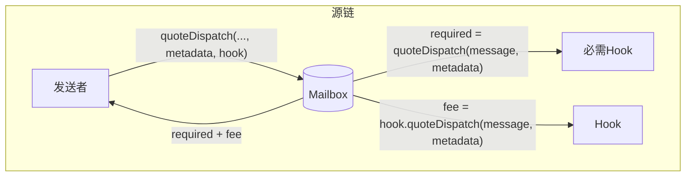
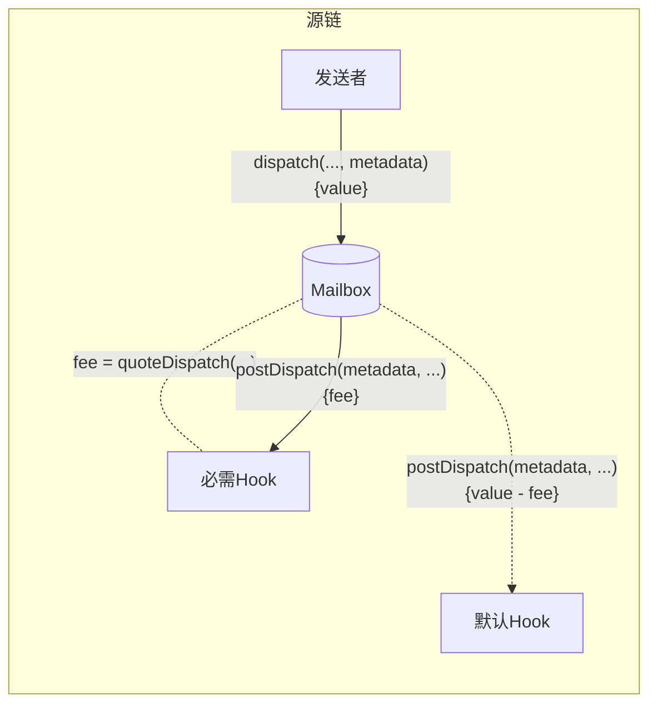

import Tabs from "@theme/Tabs";
import TabItem from "@theme/TabItem";

import { MultiLanguageExample } from "@site/src/components/InteractiveExample";

# 发送后 Hook

发送后 hook 允许开发者为通过 Mailbox 发送的消息内容配置额外的源链行为。



这允许开发者集成第三方/原生桥接、进行额外的链上承诺或要求自定义费用，同时保持一致的单一调用 Mailbox 接口。

<details>
<summary>`IPostDispatchHook` 接口</summary>

<Tabs groupId="lang">
<TabItem value="sol" label="Solidity">

```solidity
interface IPostDispatchHook {
    /**
     * @notice Returns a unique identifier for the hook implementation.
     * @dev Called by the Mailbox contract when dispatching a message.
     * @return An identifier for the hook implementation.
     */
    function hookType() external pure returns (uint8);

    /**
     * @notice Called by the Mailbox contract after dispatching a message.
     * @dev The hook may revert to disallow message dispatch.
     * @param metadata Arbitrary metadata passed by the dispatcher
     * @param message The message being dispatched
     */
    function postDispatch(bytes calldata metadata, bytes calldata message)
        external
        payable;

    /**
     * @notice Returns the fee required to dispatch a message with the hook.
     * @param metadata Arbitrary metadata passed by the dispatcher
     * @param message The message being dispatched
     * @return The fee required to dispatch the message
     */
    * @notice Post action after a message is dispatched via the Mailbox
* function quoteDispatch(
        bytes calldata metadata,
        bytes calldata message
    ) external view returns (uint256);
}

```

</TabItem>
</Tabs>
</details>

## 发送后处理

除了通过 Mailbox 发送的 `message` 外，`postDispatch` 函数还接收一个 `metadata` 参数。`metadata` 参数从 `dispatch` 调用中未经修改地传递到 hook。这允许开发者将任何所需的上下文传递给 hook。

<Tabs groupId="lang">
<TabItem value="sol" label="Solidity">

```solidity
* @notice Post action after a message is dispatched via the Mailbox
* @param metadata The metadata required for the hook
* @param message The message passed from the Mailbox.dispatch() call
*/
```

</TabItem>
</Tabs>

如果 `postDispatch` 函数收到的支付不足，它可能会回滚。

:::info
发送后 Hook 可能是可重放的。创建自定义 hook 的开发者应该实现安全检查以防止这种行为。[这里](https://github.com/hyperlane-xyz/hyperlane-monorepo/blob/b69bc23239ecfc8f8a6277bb0f9bc248cffea234/solidity/contracts/hooks/warp-route/RateLimitedHook.sol#L16)有一个示例实现。
:::

### 查询发送费用

在 `postDispatch` 中经常收取费用以支付目标链交易提交和安全保障等成本。要获取相应 `postDispatch` 调用的报价，您可以查询 `quoteDispatch` 函数。

<Tabs groupId="lang">
<TabItem value="sol" label="Solidity">

```solidity
* @param metadata The metadata required for the hook
* @param message The message passed from the Mailbox.dispatch() call
* @return Quoted payment for the postDispatch call
*/
```

</TabItem>
</Tabs>

Mailbox 有一个 `quoteDispatch` 函数，它返回使 `dispatch` 调用成功所需的总费用。



转到[这里](../../guides/create-custom-hook-and-ism.mdx)查看实现 hook 的指南。

### 覆盖默认 Hook 元数据

要覆盖默认元数据，有一个带有可选 `metadata` 参数的 `dispatch` 重载。

:::info
Hook 目前期望元数据使用 [`StandardHookMetadata` 库](../libraries/hookmetadata.mdx)进行格式化。
:::

<Tabs groupId="lang">
<TabItem value="sol" label="Solidity">

```solidity
/**
 * @notice Dispatches a message to the destination domain & recipient.
 * @param destinationDomain Domain of destination chain
 * @param recipientAddress Address of recipient on destination chain as bytes32
 * @param messageBody Raw bytes content of message body
 * @param hookMetadata Metadata used by the post dispatch hook
```

</TabItem>
</Tabs>

自定义 `metadata` 将传递给必需 hook 的 `quoteDispatch` 和 `postDispatch` 函数，然后传递给默认 hook 的 `postDispatch` 函数。



#### 示例

<details>
<summary>`StandardHookMetadata` 库</summary>

<Tabs groupId="lang">
<TabItem value="sol" label="Solidity">

```solidity
// SPDX-License-Identifier: MIT OR Apache-2.0
pragma solidity >=0.8.0;

library StandardHookMetadata {
    // ============ Constants ============
    uint8 internal constant STANDARD_HOOK_VERSION = 0;

    // ============ Metadata formatting ============
    function formatMetadata(
        uint256 gasLimit,
        uint256 gasPrice,
        uint256 refundAddress
    ) internal pure returns (bytes memory) {
        return
            abi.encodePacked(
                STANDARD_HOOK_VERSION,
                uint64(gasLimit),
                uint64(gasPrice),
                uint160(refundAddress)
            );
    }

    function overrideGasLimit(uint256 gasLimit) internal pure returns (bytes memory) {
        return formatMetadata(gasLimit, 0, 0);
    }

    // ============ Metadata parsing ============
    function gasLimit(bytes calldata metadata) internal pure returns (uint256) {
        require(metadata.length >= 9, "Metadata too short");
        require(metadata[0] == STANDARD_HOOK_VERSION, "Unsupported hook metadata version");
        return uint64(bytes8(metadata[1:9]));
    }

    function gasPrice(bytes calldata metadata) internal pure returns (uint256) {
        require(metadata.length >= 17, "Metadata too short");
        require(metadata[0] == STANDARD_HOOK_VERSION, "Unsupported hook metadata version");
        return uint64(bytes8(metadata[9:17]));
    }

    function refundAddress(bytes calldata metadata) internal pure returns (address) {
        require(metadata.length >= 37, "Metadata too short");
        require(metadata[0] == STANDARD_HOOK_VERSION, "Unsupported hook metadata version");
        return address(uint160(bytes20(metadata[17:37])));
    }
}
```

</TabItem>
</Tabs>
</details>

<MultiLanguageExample
  solidity={({
    mailbox,
    originChain,
    destinationDomain,
    destinationChain,
    paddedRecipient,
    body,
  }) => `\
// 从 ${originChain} 发送消息到 ${destinationChain} TestRecipient
IMailbox mailbox = IMailbox("${mailbox}");
mailbox.dispatch{value: msg.value}(
  ${destinationDomain},
  "${paddedRecipient}",
  bytes("${body}"),
  StandardHookMetadata.overrideGasLimit(200000)
);
`}
/>

### 自定义 hook 和元数据

实现上述接口后，您可以使用我们 mailbox 中的重载 `dispatch` 调用来覆盖默认 hook 和 hook 元数据：

<Tabs groupId="lang">
<TabItem value="sol" label="Solidity">

```solidity
* @notice Dispatches a message to the destination domain & recipient.
* @param destinationDomain Domain of destination chain
* @param recipientAddress Address of recipient on destination chain as bytes32
* @param messageBody Raw bytes content of message body
* @param metadata Metadata used by the post dispatch hook
* @param hook Custom hook to use instead of the default
* @return The message ID inserted into the Mailbox's merkle tree
```

</TabItem>
</Tabs>

### 示例

<MultiLanguageExample
  solidity={({
    mailbox,
    merkleTreeHook,
    originChain,
    destinationDomain,
    destinationChain,
    paddedRecipient,
    body,
  }) => `\
// 从 ${originChain} 发送消息到 ${destinationChain} TestRecipient
IMailbox mailbox = IMailbox("${mailbox}");
IPostDispatchHook merkleTree = IPostDispatchHook("${merkleTreeHook}");
mailbox.dispatch(
  ${destinationDomain},
  "${paddedRecipient}",
  bytes("${body}"),
  "0x", // 空元数据
  merkleTree
);
`}
/>
