# Polygon PoS Hook

Polygon PoS 有自己的以太坊和 Polygon 之间的消息传递接口，称为 [`fx portal`](https://github.com/0xPolygon/fx-portal)。通过此接口传递的消息受益于 Polygon [状态同步机制](https://docs.polygon.technology/pos/architecture/bor/state-sync/)的安全性。

为了在 Hyperlane 中提供这种安全性选项，我们创建了一个 Hook 和 ISM 组合，可以透明地配置以重用 fx-portal 接口。

有关 Hook 和 ISM 地址，请参见[地址](../contract-addresses.mdx)页面。

## 工作原理

Polygon FX-Portal 提供 FxChild (FxChild.sol) 和 FxRoot (FxRoot.sol) 作为桥接工作的主要合约。它可以调用并将数据传递到另一条链上的用户定义方法，而无需映射。

FxChild/FxRoot 合约由 polygon 团队提供和维护。您可以在 Polygon 的 [Fx-Portal 仓库](https://github.com/0xPolygon/fx-portal)中找到此合约的地址。
PolygonPosHook 通过 FxRoot 发送有效负载。验证者将获取消息并将其传递到另一条链。您可以在[文档](https://docs.polygon.technology/pos/how-to/bridging/l1-l2-communication/state-transfer/)中找到详细的状态同步机制。位于 `0x0000000000000000000000000000000000001001` 的 `StateReceiver` 被允许在 FxChild 合约中调用 `onStateReceive`。FxChild 在抽象的 `CrossChainEnabledPolygonChild` 中调用 `processMessageFromRoot`，PolygonPosISM 实现了该抽象合约。`CrossChainEnabledPolygonChild` 由 [OpenZeppelin](https://docs.openzeppelin.com/contracts/4.x/api/crosschain#) 维护。

```mermaid
flowchart TB
    subgraph Origin Ethereum[源以太坊]
      Sender[发送者]
      M_O[(Mailbox)]
      Hook[PolygonPosHook]
      Eth[(FxRoot)]

      Sender -- "dispatch(...)" --> M_O
      M_O -- "postDispatch(message)" --> Hook
      Hook -- "sendMessage(messageId)" --> Eth
    end

    M_O -. "中继" .-> M_D
    Eth -. "验证者节点" .-> Polygon

    subgraph Destination Polygon PoS[目标 Polygon PoS]
      Recipient[接收者]
      M_D[(Mailbox)]
      ISM{PolygonPosISM}
      Polygon[(FxChild)]

      M_D -- "verify(..., message)" --> ISM
      M_D -- "handle(...)" --> Recipient
      ISM -. "interchainSecurityModule()" .- Recipient

      Polygon -- "verifyMessageId(messageId)" --> ISM
    end

    style Eth fill:#ff0402
    style Polygon fill:#ff0402
```

