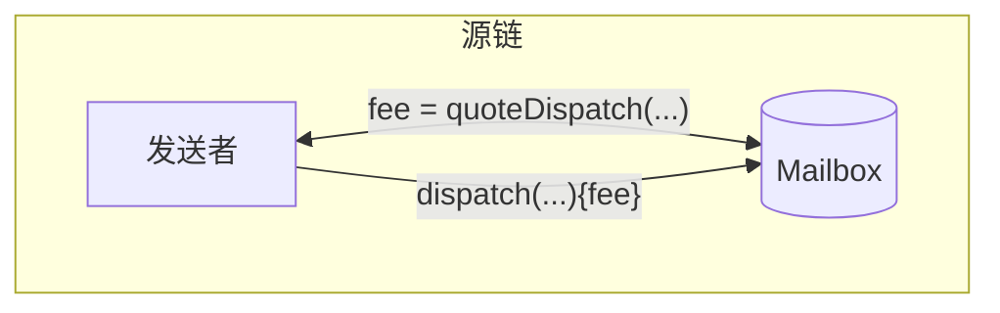
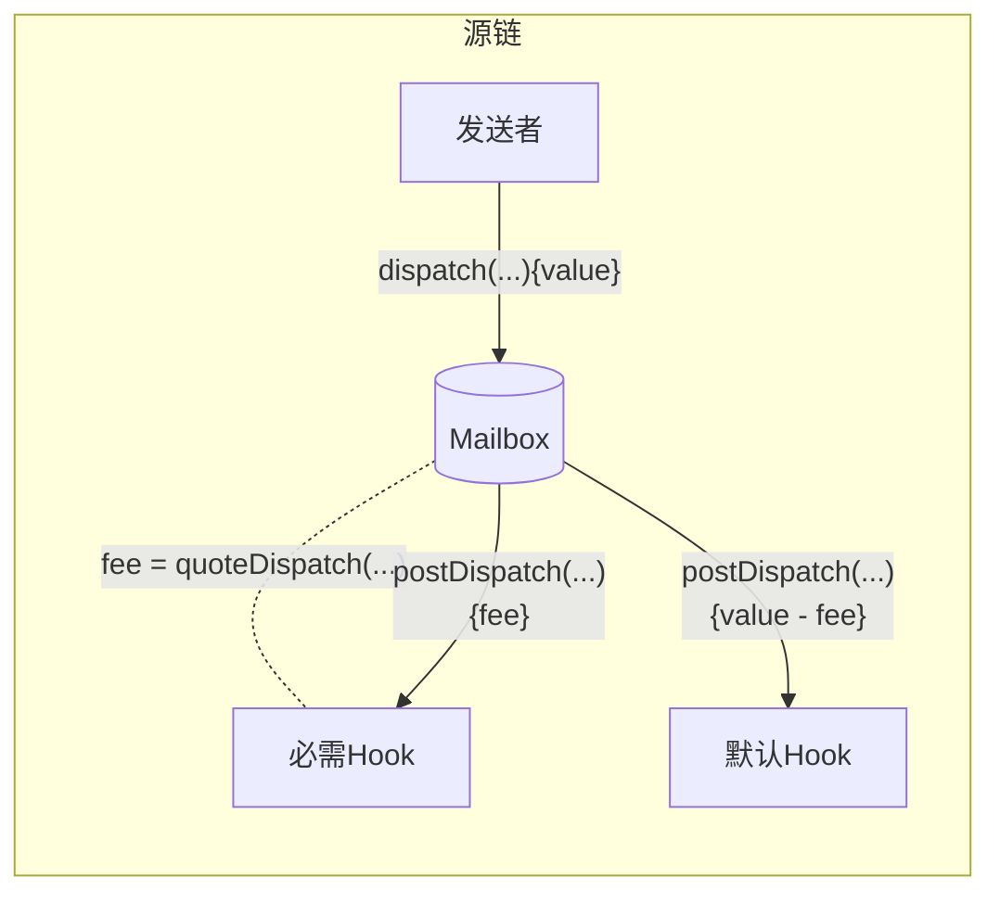

import Tabs from "@theme/Tabs";
import TabItem from "@theme/TabItem";

import { MultiLanguageExample } from "@site/src/components/InteractiveExample";

import SimpleMessagingDiagram from "@site/src/diagrams/messaging-simple.md";

# 发送消息

要发送跨链消息，开发者需要调用 `Mailbox.dispatch()`。

该函数的参数包括消息内容、目标链 ID 和接收者地址。每条消息都会作为叶子节点插入到 `Mailbox` 存储的[增量默克尔树](https://medium.com/@josephdelong/ethereum-2-0-deposit-merkle-tree-13ec8404ca4f)中。Hyperlane 的权益证明协议使用这个默克尔树来验证欺诈证明。

<SimpleMessagingDiagram />

## 发送

调用此函数将消息发送到目标域和接收者。

:::warning
Hyperlane 只能将消息传递给实现了 `handle` 函数的智能合约。有关更多信息，请参阅[接收消息](./receive.mdx)文档。
:::

根据[发送后 hook 配置](##post-dispatch-hook-config)，可能需要支付一些费用。有关更多信息，请参阅 [`quoteDispatch`](#quote-dispatch) 部分。

<Tabs groupId="lang">
<TabItem value="sol" label="Solidity">

```solidity
function dispatch(
    uint32 destination,
    bytes32 recipient,
    bytes calldata body
) external payable returns (bytes32);
```

:::info
接收者地址会被左填充为 `bytes32` 以兼容不同寻址方式的虚拟机。为了方便起见，[`TypeCasts` 库](../libraries/typecasts.mdx)提供了以下实用工具。

```solidity
library TypeCasts {
    function addressToBytes32(address addr) internal pure returns (bytes32) {
        return bytes32(uint256(uint160(addr)));
    }
}
```

:::

</TabItem>

</Tabs>

### 示例

<MultiLanguageExample
  solidity={({
    mailbox,
    originChain,
    destinationDomain,
    destinationChain,
    paddedRecipient,
    body,
  }) => `\
// 从 ${originChain} 发送消息到 ${destinationChain} TestRecipient
IMailbox mailbox = IMailbox("${mailbox}");
bytes32 messageId = mailbox.dispatch{value: msg.value}(
  ${destinationDomain},
  "${paddedRecipient}",
  bytes(\"${body}\")
);`}
/>

## 查询发送费用

费用通常被配置为覆盖 IGP 支付以及协议成本。这包括目标链上的交易提交、安全保障和维护费用。要获取相应 `dispatch` 调用的费用报价，您可以查询 `quoteDispatch` 函数。



<Tabs groupId="lang">
<TabItem value="sol" label="Solidity">

```solidity
function quoteDispatch(
    uint32 destination,
    bytes32 recipient,
    bytes calldata body
) external view returns (uint256);
```

必须将报价的 `fee` 作为 value 传递给 `dispatch` 调用，以确保它不会回滚。

</TabItem>

</Tabs>

### 示例

<MultiLanguageExample
  solidity={({
    mailbox,
    originChain,
    destinationDomain,
    destinationChain,
    paddedRecipient,
    body,
  }) => `\
// 查询从 ${originChain} 发送消息到 ${destinationChain} TestRecipient 的费用
IMailbox mailbox = IMailbox("${mailbox}");
uint32 destination = ${destinationDomain};
bytes32 recipient = "${paddedRecipient}";
bytes memory body = bytes("${body}");
uint256 fee = mailbox.quoteDispatch(destination, recipient, body);
mailbox.dispatch{value: fee}(destination, recipient, body);
`}
/>

:::danger
向 `dispatch` 支付的费用不足将导致回滚。如果您正在组合多个 hook，多支付的费用**可能不会**退还给消息发送者。
:::

## 发送后 Hook 配置

Mailbox 上配置了两个 hook：

- `required`：对所有支付了所需费用的 `dispatch` 调用都会调用此 hook
- `default`：在支付 `required` hook 费用后，使用剩余 value 调用此 hook（除非被覆盖）



### 必需 Hook

要查询必需 hook 配置，您可以调用 `requiredHook` 函数。

<Tabs groupId="lang">
<TabItem value="sol" label="Solidity">

```solidity
function requiredHook() external view returns (IPostDispatchHook);
```

</TabItem>
</Tabs>

### 默认 Hook

要查询默认 hook 配置，您可以调用 `defaultHook` 函数。

<Tabs groupId="lang">
<TabItem value="sol" label="Solidity">

```solidity
function defaultHook() external view returns (IPostDispatchHook);
```

</TabItem>
</Tabs>

要在 `dispatch` 调用中用自定义 hook 覆盖默认 hook，请参阅 [Hooks 参考](../hooks/overview.mdx)。
