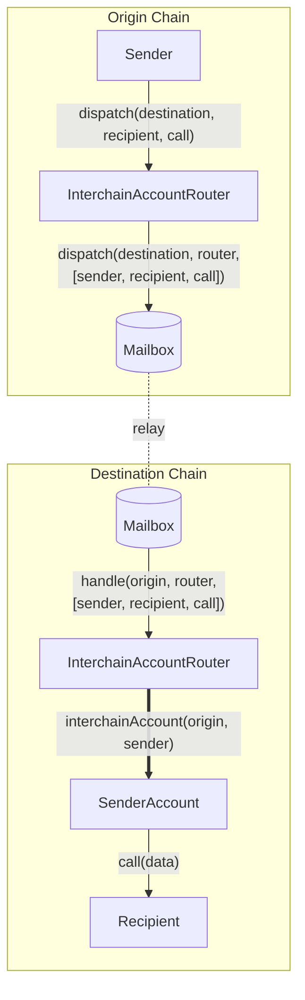

```mermaid
flowchart TB
    subgraph Origin Chain
      Sender
      A_O[InterchainAccountRouter]
      M_O[(Mailbox)]
    end

    subgraph Destination Chain
      M_D[(Mailbox)]
      A_D[InterchainAccountRouter]
      SenderAccount
      Recipient
    end

    Sender -- "dispatch(destination, recipient, call)" --> A_O
    A_O -- "dispatch(destination, router, <br>[sender, recipient, call])" --> M_O
    M_O -. "relay" .- M_D
    M_D -- "handle(origin, router, <br>[sender, recipient, call])" --> A_D
    A_D == "interchainAccount(origin, sender)" ==> SenderAccount
    SenderAccount -- "call(data)" --> Recipient
```
