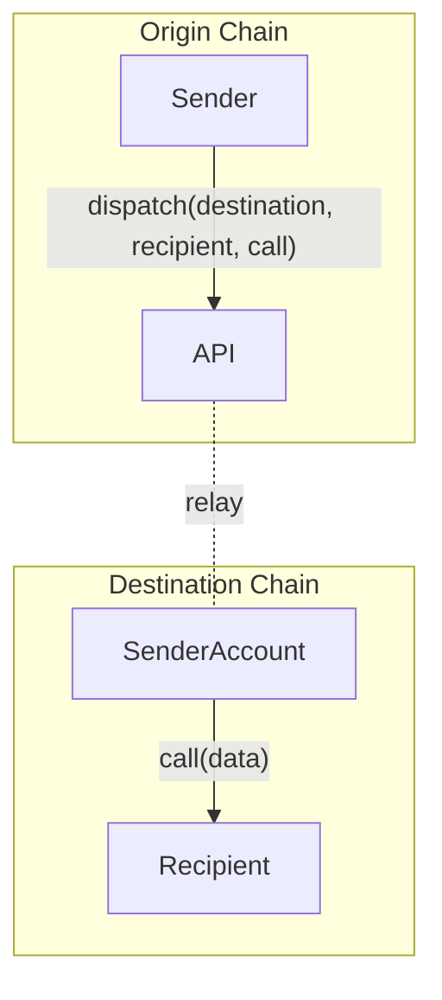

```mermaid
flowchart TB
    subgraph Origin Chain
      Sender
      A_O[API]
    end

    subgraph Destination Chain
      SenderAccount
      Recipient
    end

    Sender -- "dispatch(destination, recipient, call)" --> A_O
    A_O -. "relay" .- SenderAccount
    SenderAccount -- "call(data)" --> Recipient
```