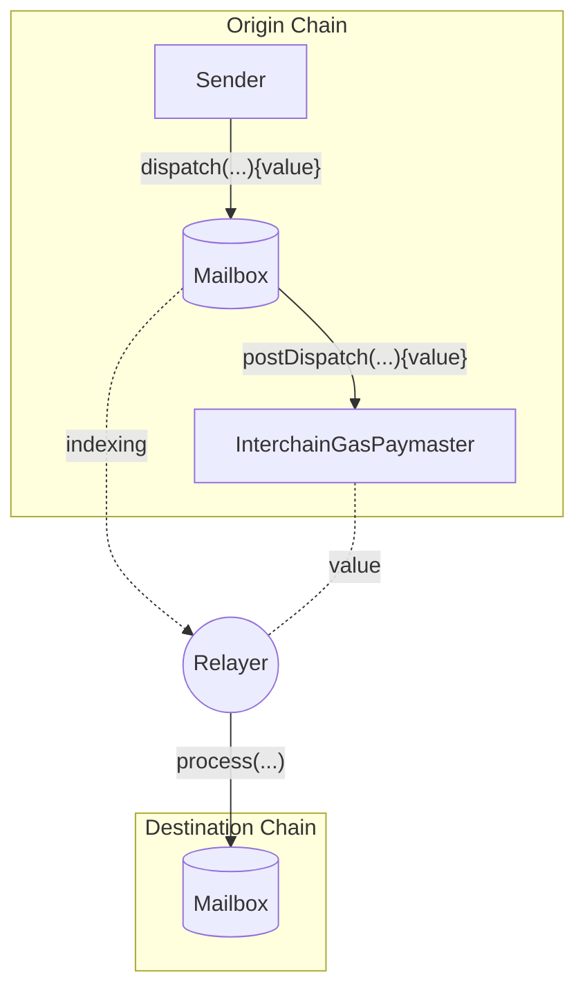

```mermaid
flowchart TB
    subgraph Origin Chain
      Sender
      M_O[(Mailbox)]
      IGP[InterchainGasPaymaster]
      Sender -- "dispatch(...){value}" --> M_O
      M_O -- "postDispatch(...){value}" --> IGP
    end

    Relayer((Relayer))

    M_O -. "indexing" .-> Relayer
    IGP -. "value" .- Relayer

    subgraph Destination Chain
      M_D[(Mailbox)]
    end

    Relayer -- "process(...)" --> M_D
```
