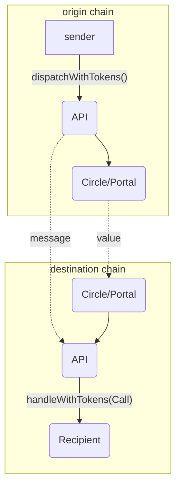

```mermaid
flowchart TB
	subgraph origin chain
		sender --"dispatchWithTokens()"--> HypO(API)
        HypO --> AdapterO(Circle/Portal)
        
	end

	HypO -."message".-> HypD
	AdapterO -."value".-> AdapterD
    

	subgraph destination chain
        AdapterD(Circle/Portal) --> HypD
    

		HypD(API) --"handleWithTokens(Call)"--> recipient(Recipient)
	end
```
