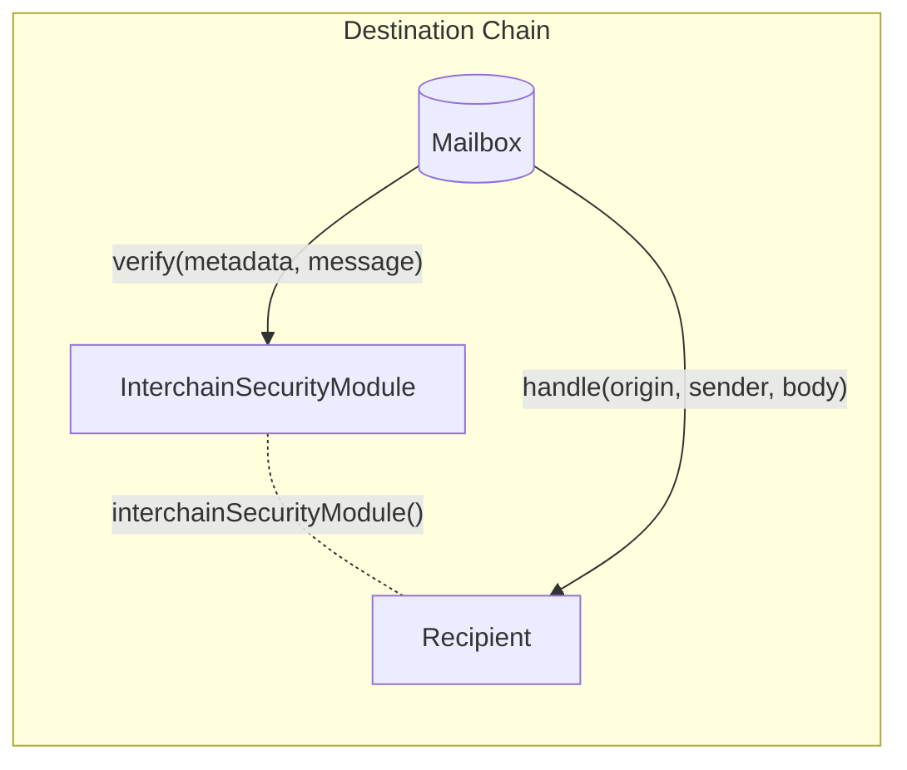

```mermaid
flowchart LR
    subgraph Destination Chain
      ISM[InterchainSecurityModule]
      Recipient[Recipient]
      M_D[(Mailbox)]

      M_D -- "verify(metadata, message)" --> ISM
      ISM -. "interchainSecurityModule()" .- Recipient
      M_D -- "handle(origin, sender, body)" --> Recipient

    end
```
