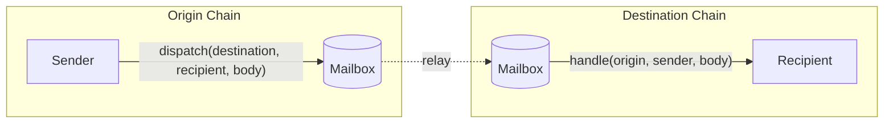

```mermaid
flowchart LR
    subgraph Origin Chain
      Sender
      M_O[(Mailbox)]
      Sender -- "dispatch(destination, recipient, body)" --> M_O
    end

    subgraph Destination Chain
      Recipient[Recipient]
      M_D[(Mailbox)]

      M_D -- "handle(origin, sender, body)" --> Recipient
    end

    M_O -. "relay" .-> M_D
```
