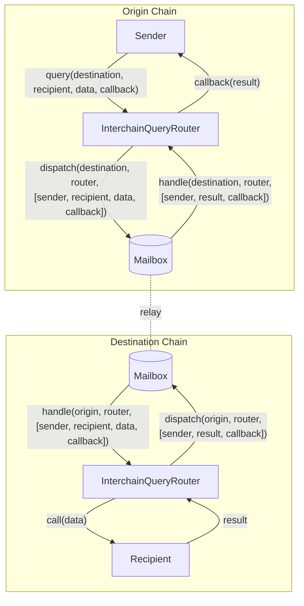

```mermaid
flowchart TB
    subgraph Origin Chain
      Sender
      Q_O[InterchainQueryRouter]
      M_O[(Mailbox)]
    end

    subgraph Destination Chain
      M_D[(Mailbox)]
      Q_D[InterchainQueryRouter]
      Recipient
    end

    Sender -- "query(destination, recipient, data, callback)" --> Q_O
    Q_O -- "dispatch(destination, router, \n[sender, recipient, data, callback])" --> M_O
    M_O -. "relay" .- M_D
    M_D -- "handle(origin, router, \n[sender, recipient, data, callback])" --> Q_D
    Q_D -- "call(data)" --> Recipient
    Recipient -- "result" --> Q_D
    M_O -- "handle(destination, router, \n[sender, result, callback])" --> Q_O
    Q_D -- "dispatch(origin, router, \n[sender, result, callback])" --> M_D
    Q_O -- "callback(result)" --> Sender
```