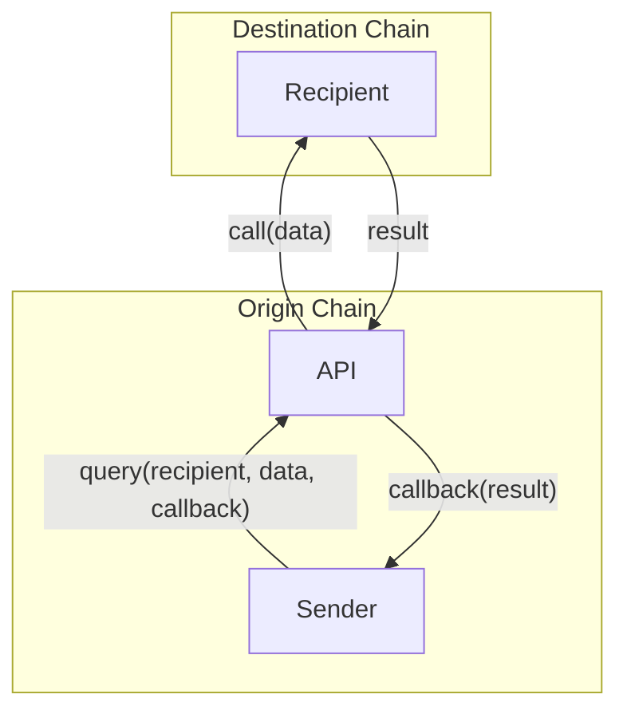

```mermaid
flowchart BT
    subgraph Origin Chain
      Sender
      Q_O[API]
    end

    subgraph Destination Chain
      Recipient[Recipient]
    end

    Sender -- "query(recipient, data, callback)" --> Q_O
    Recipient -- "result" --> Q_O
    Q_O -- "call(data)" --> Recipient
    Q_O -- "callback(result)" --> Sender
```