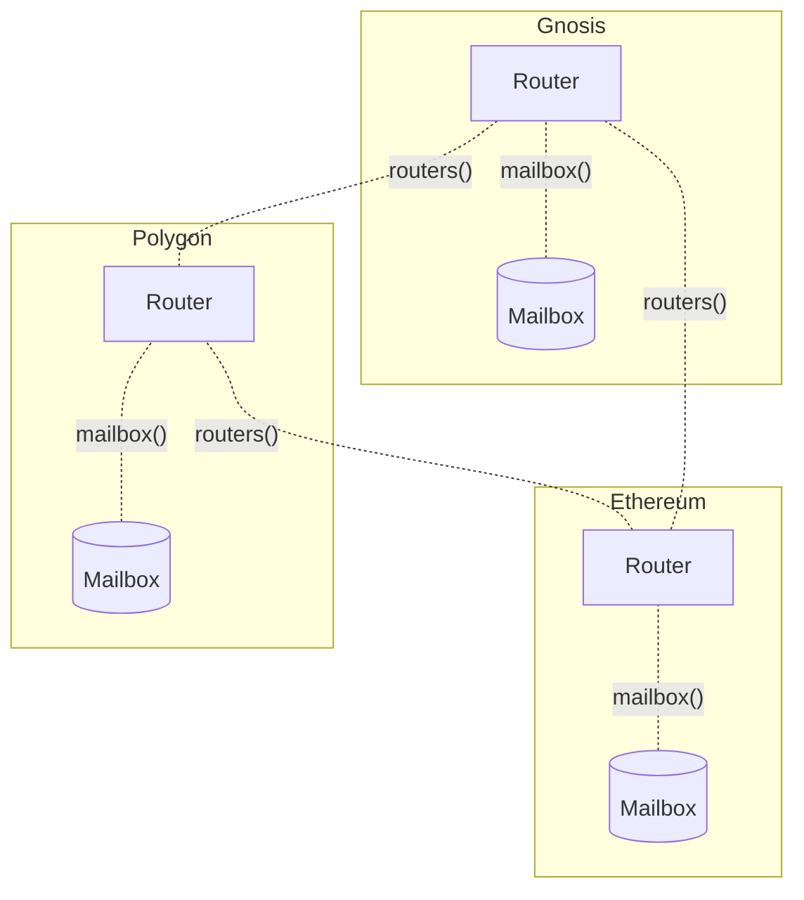

```mermaid

graph BT
    subgraph "Ethereum"
        R_E[Router]
        Mailbox_E[(Mailbox)]
        Mailbox_E -. "mailbox()" .- R_E
    end

    subgraph "Polygon"
        R_P[Router]
        Mailbox_P[(Mailbox)]
        Mailbox_P -. "mailbox()" .- R_P
    end

    subgraph "Gnosis"
        R_G[Router]
        Mailbox_G[(Mailbox)]
        Mailbox_G -. "mailbox()" .- R_G
    end

    R_E -. "routers()" .- R_P -. "routers()" .- R_G
    R_G -. "routers()" .- R_E
```
